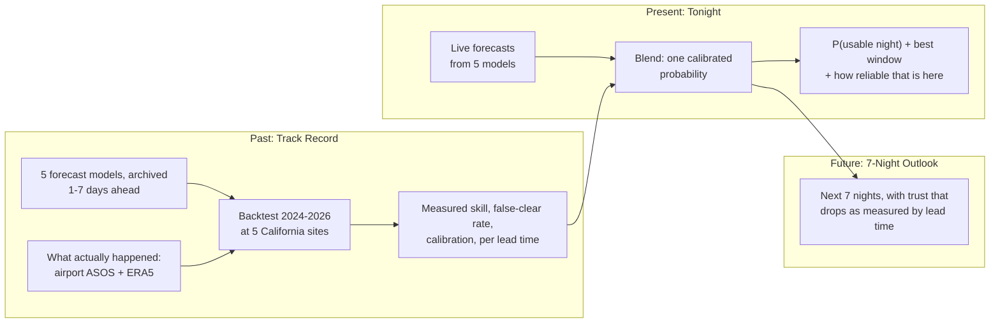

# SkyTrust 🔭

**An astronomy cloud forecast that tells you how often it's been wrong.**

[](https://github.com/hitenjain22/skytrust/actions/workflows/ci.yml)

**Live app:** _deploying soon: link will go here_ · **Full results:** [docs/RESULTS.md](docs/RESULTS.md)

<p align="center">
  
  &nbsp;
  
</p>

## The problem

Astrophotographers routinely check five or six forecast apps plus satellite loops before deciding
to set up, because the forecasts disagree and none says how reliable it is. The most common
complaint in reviews and forums is the **false clear**: the forecast said clear, you spent an hour
setting up, and it clouded over. High cirrus, which ruins deep-sky imaging, is often reported as
"clear" by general weather forecasts. And no app shows its own track record at your location.

SkyTrust measures that track record, then uses it.

## How it works



- **A usable night** = at least 3 consecutive clear hours (≤ 20% cloud) during astronomical
  darkness. A missing hour breaks the run; nights with too much missing data are excluded, never
  counted as cloudy.
- **Truth** comes from two sources with opposite blind spots: airport ceilometers (real
  observations, but blind above 12,000 ft, so they miss cirrus) and ERA5 reanalysis (sees every
  layer, but it's a model). An hour counts as clear only if both agree.
- **No look-ahead bias:** the backtest uses the forecasts that were actually issued 1-7 days
  ahead (Open-Meteo Previous Runs), not the stitched "freshest run" archive.
- **The blend** is a logistic regression per lead time over every model's forecast, how much the
  models disagree, and site/season context. It's trained on 2024-25 and tested once on 2026.

## Headline results

<!-- RESULTS:START -->

| Night-before forecast (lead 1), test year | Brier Skill Score ↑ | False-clear rate ↓ | AUC ↑ |
|---|---|---|---|
| Blend | 0.627 [0.569, 0.676] | 9.4% [7.0%, 12.2%] | 0.948 |
| Equal-weight average (B5) | 0.596 [0.540, 0.645] | 13.2% [10.4%, 16.3%] | 0.937 |
| ECMWF calibrated (B4) | 0.515 [0.444, 0.581] | 12.5% [9.5%, 15.7%] | 0.920 |
| Climatology (B1) | 0.000 [0.000, 0.000] | 36.6% [30.0%, 43.6%] | 0.634 |

_Auto-generated from `artifacts/metrics.json` by `python -m skytrust report` (commit `1384dc9`). 95% CIs from a week-block bootstrap. Full results: [docs/RESULTS.md](docs/RESULTS.md)._

<!-- RESULTS:END -->

Measured on the 2026 test year, a period none of the models saw during training. The blend beats
every single model at every lead time, but beats a plain average of the models at only some leads;
[docs/RESULTS.md](docs/RESULTS.md) says exactly where, with confidence intervals for everything.

<p align="center">
  
</p>

## Methodology and caveats

The short version is above; the app's **Methodology** page and [docs/RESULTS.md](docs/RESULTS.md)
have the details. Key caveats:
- Airport ceilometers can't see cirrus; ERA5 is a model on a ~28 km grid and is made by ECMWF
  (so ECMWF may look better than it is under ERA5-based labels; results flag this).
- One test year; point observations vs gridded forecasts; the live "tonight" forecast is fresher
  than the 1-day-ahead backtest data, so tonight's probability is slightly conservative.

Design decisions and their reasons are logged in [docs/DECISIONS.md](docs/DECISIONS.md);
what the data sources actually do is in [docs/DATA_NOTES.md](docs/DATA_NOTES.md);
data coverage and base rates are in [docs/DATA_QUALITY.md](docs/DATA_QUALITY.md).

## Run it locally

```bash
curl -LsSf https://astral.sh/uv/install.sh | sh   # installs uv (Python + virtual-env manager)
uv sync                                           # Python 3.12 + pinned dependencies into .venv
make app                                          # the Streamlit app -> http://localhost:8501
make tonight SITE=BIH                             # the same forecast as text in the terminal
```

Tests (all offline, using recorded API responses):

```bash
make test          # everything, incl. Streamlit app smoke tests (what CI runs)
uv run pytest      # quick loop: skips the slower app tests
```

Rebuild everything from raw data (about 1,000 downloads on the first run, then cached):

```bash
make all           # fetch -> build-dataset -> train -> evaluate -> report
```

Useful single steps: `python -m skytrust validate-sites | fetch --source {asos,era5,prevruns} |
build-dataset | train | evaluate | report | tonight --site ID`.

## Project structure

```
src/skytrust/
  data/          http client (retries, typed errors), disk cache, IEM + Open-Meteo clients, backfill
  astro.py       dusk/dawn/dark hours and the Moon (Skyfield, offline DE421 excerpt)
  nightly.py     the usable-night rules, shared by labels, features, and live
  labels.py      ASOS / ERA5 / primary labels     features.py   per-model forecast features
  dataset.py     joins everything -> data/processed/dataset.parquet (validated)
  baselines.py   climatology, persistence, single models, equal-weight average
  modeling.py    leakage-safe split, date-grouped CV, tuned logistic regression
  blend.py       trains the per-lead blend, calibration check, JSON export
  inference.py   numpy-only model loading/prediction (what the app runs)
  evaluate.py    metrics + week-block bootstrap CIs     report.py   RESULTS.md, README block
  live.py        tonight + 7-night outlook, last-good cache fallback
app/             Streamlit app (4 pages)
artifacts/       model_lead{1..7}.json, metrics.json (committed; the app reads only these)
config/          settings.yaml (all thresholds), sites.yaml (from IEM metadata)
docs/            RESULTS, DATA_QUALITY, DATA_NOTES, DECISIONS, LEARNING, figures, screenshots
tests/           offline tests + recorded API fixtures + a synthetic raw-data generator
```

## Next steps

Out of scope for v1, and natural extensions:
- **Dew timer:** when optics will dew up from radiative cooling.
- **Central Valley fog / inversion mode:** tule fog, and "drive above X ft".
- **Mid-latitude aurora module.**
- **GOES satellite clear-sky mask as ground truth:** fixes the ceilometer's cirrus blind spot.
- **Satellite cloud-motion nowcasting** for the next few hours.

## Data attribution

Weather data by [Open-Meteo.com](https://open-meteo.com/), licensed
[CC BY 4.0](https://creativecommons.org/licenses/by/4.0/). ASOS observations courtesy of the
[Iowa Environmental Mesonet](https://mesonet.agron.iastate.edu/), Iowa State University.
Astronomy computed with [Skyfield](https://rhodesmill.org/skyfield/) and JPL's DE421 ephemeris.

---

<sub>Built by Hiten Jain as a statistics / operations research portfolio project, with Claude Code
as an AI pair programmer. [docs/LEARNING.md](docs/LEARNING.md) explains every module and the
reasoning behind it.</sub>
