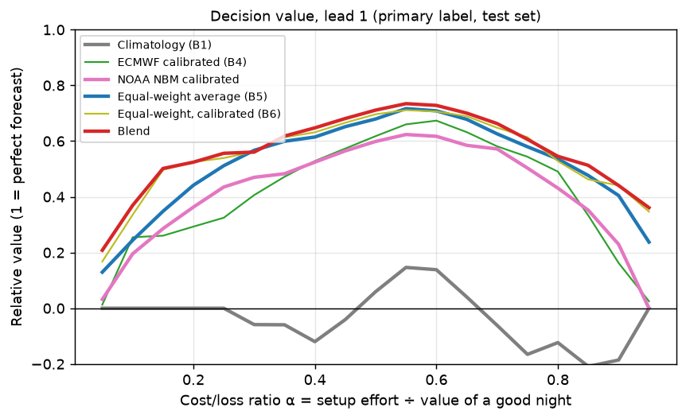

# Results

_Generated by `python -m skytrust report` from `artifacts/metrics.json` (evaluation run 2026-09-30T02:55:23Z, commit `808c52b`). Do not edit by hand._

**Setup.** Train on nights 2024-01-01 → 2025-12-31; test on 2026-01-01 → 2026-08-31 (never used for fitting or tuning). Each method is scored on the same test nights per lead (at lead 1: 1111 site-nights over 35 weeks). 95% CIs from a block bootstrap that resamples whole ISO calendar weeks (1000 resamples, seed 20260101).

## Summary

- **The learned blend** has a Brier Skill Score of **0.631 [0.574, 0.685]** at lead 1 and a false-clear rate of **10.0% [7.4%, 12.8%]**. Versus the best single model (ECMWF calibrated (B4)): better (Brier difference -0.0280 [-0.0379, -0.0186], CI excludes zero). Versus the equal-weight average: better (Brier difference -0.0078 [-0.0134, -0.0017], CI excludes zero).
- **Versus NOAA's National Blend of Models (NBM)**, NOAA's own statistical blend, calibrated here with the same site/season context (BSS 0.508 [0.428, 0.583]): at lead 1 SkyTrust's blend is better (Brier difference -0.0304 [-0.0421, -0.0189], CI excludes zero). NBM's raw forecast used directly as a probability scores 0.468 [0.370, 0.557]; it isn't a calibrated probability, so the calibrated version is the fair comparison.
- **Would NBM help as an input?** A research variant of the blend that also sees NBM (trained only on the ~15 months NBM's archive covers) is not significantly different (Brier difference +0.0005 [-0.0031, +0.0037]) compared with the shipped blend at the same lead. The shipped model is unchanged either way, so the live forward test keeps scoring one fixed model.
- Across leads, the blend beats the best single model with a 95% CI excluding zero at **7 of 7 leads**.
- Across leads, the blend beats the simple equal-weight average with a 95% CI excluding zero at **2 of 7 leads**. **At leads 2, 4, 5, 6, 7 it does not beat the simple equal-weight average.**
- Across leads, the blend beats the calibrated equal-weight average (B6: same model, one shared weight) with a 95% CI excluding zero at **1 of 7 leads**. **At leads 2, 3, 4, 5, 6, 7 it does not beat the calibrated equal-weight average (B6: same model, one shared weight).**
- Across leads, the blend beats NOAA's calibrated NBM with a 95% CI excluding zero at **5 of 7 leads**. **At leads 5, 7 it does not beat NOAA's calibrated NBM.**
- **Where does the skill come from?** Measured step by step: averaging the models beats the best single model significantly at 6 of 7 leads; calibrating that average with site/season context (B6 vs B5) at 1 of 7; learning a separate weight per model (blend vs B6) at 1 of 7. Most of the value is simply combining several models, the *forecast combination puzzle*: a plain average is hard to beat with learned weights.
- At lead 1 (the night-before forecast), the **equal-weight average of 5 models** has a Brier Skill Score of **0.600 [0.542, 0.652]** relative to climatology. The best single calibrated model (ECMWF calibrated (B4), chosen by *training* cross-validation, never by test results) scores 0.518 [0.446, 0.586].
- The equal-weight average beats the best single model with a 95% CI excluding zero at **6 of 7 leads** (not significant at lead 7).
- False-clear rate at lead 1 (of nights called "go" at P ≥ 0.5, the share that were not usable): **13.8% [11.1%, 16.7%]** for the equal-weight average vs 37.5% [30.6%, 45.1%] for climatology.
- Skill decays with lead time: equal-weight BSS falls from 0.600 at lead 1 to 0.169 at lead 7, and its false-clear rate rises from 13.8% to 30.6%.
- Under the **ASOS-only label** the picture changes: equal-weight BSS at lead 1 is -0.440 [-0.835, -0.127]. The models forecast *total* cloud (including cirrus), while ASOS only reports cloud below 12,000 ft, so they're scored against a truth that ignores part of what they predict. A blend trained on that label learns the relationship directly and scores 0.338 [0.211, 0.438]. See the label sensitivity section.
- ⚠ ECMWF is the best single model (by training CV) under the **era5** label at lead(s) 2, 3, 4, 5, 6, 7. ERA5 is produced by ECMWF, so part of this may be shared model physics rather than real-world skill.
- ⚠ ECMWF is the best single model (by training CV) under the **primary** label at lead(s) 1, 2, 3, 4, 5, 6, 7. ERA5 is produced by ECMWF, so part of this may be shared model physics rather than real-world skill.

## 1. Headline: primary label, lead 1

| method | Brier ↓ | BSS ↑ | log loss ↓ | AUC ↑ | false-clear ↓ | miss rate ↓ |
|---|---|---|---|---|---|---|
| Climatology (B1) | 0.246 [0.217, 0.275] | 0.000 [0.000, 0.000] | 0.695 | 0.630 | 37.5% [30.6%, 45.1%] | 23.3% |
| Persistence (B2) | 0.341 [0.291, 0.391] | -0.386 [-0.547, -0.234] | – | – | 29.7% [23.7%, 37.2%] | 29.4% |
| GFS calibrated (B4) | 0.116 [0.097, 0.134] | 0.531 [0.463, 0.595] | 0.370 | 0.913 | 14.7% [11.3%, 18.2%] | 11.7% |
| HRRR calibrated (B4) | 0.142 [0.119, 0.165] | 0.422 [0.338, 0.500] | 0.443 | 0.875 | 16.9% [13.2%, 21.1%] | 19.5% |
| ECMWF calibrated (B4) | 0.119 [0.098, 0.138] | 0.518 [0.446, 0.586] | 0.381 | 0.920 | 13.0% [10.0%, 16.5%] | 15.5% |
| GEM calibrated (B4) | 0.145 [0.123, 0.166] | 0.411 [0.332, 0.489] | 0.452 | 0.852 | 23.8% [18.4%, 29.3%] | 4.8% |
| ICON calibrated (B4) | 0.117 [0.098, 0.135] | 0.525 [0.464, 0.590] | 0.372 | 0.914 | 14.5% [10.5%, 18.5%] | 12.3% |
| NOAA NBM (raw) | 0.131 [0.107, 0.154] | 0.468 [0.370, 0.557] | 0.629 | 0.888 | 15.4% [11.3%, 19.6%] | 15.8% |
| NOAA NBM calibrated | 0.121 [0.101, 0.140] | 0.508 [0.428, 0.583] | 0.390 | 0.907 | 16.8% [12.6%, 21.1%] | 11.7% |
| Equal-weight average (B5) | 0.099 [0.084, 0.114] | 0.600 [0.542, 0.652] | 0.334 | 0.936 | 13.8% [11.1%, 16.7%] | 9.1% |
| Equal-weight, calibrated (B6) | 0.094 [0.079, 0.111] | 0.616 [0.557, 0.670] | 0.307 | 0.942 | 11.5% [8.8%, 14.4%] | 10.8% |
| Blend | 0.091 [0.075, 0.108] | 0.631 [0.574, 0.685] | 0.294 | 0.947 | 10.0% [7.4%, 12.8%] | 11.4% |
| Blend + NBM input (research) | 0.091 [0.076, 0.107] | 0.629 [0.574, 0.682] | 0.297 | 0.946 | 11.1% [8.5%, 13.7%] | 10.9% |

BSS = 1 − Brier / Brier(climatology). Persistence is a hard yes/no, so it has no log loss or AUC.

### Hard yes/no forecasts: persistence (B2) and each model's own rule (B3), lead 1

| method (hard yes/no) | false-clear ↓ | miss rate ↓ | accuracy ↑ |
|---|---|---|---|
| Persistence (B2) | 29.7% [23.7%, 37.2%] | 29.4% [23.4%, 36.6%] | 65.9% [60.9%, 70.9%] |
| GFS rule (B3) | 16.5% [13.1%, 20.2%] | 10.6% [7.4%, 14.3%] | 83.7% [81.6%, 86.1%] |
| HRRR rule (B3) | 18.2% [14.2%, 22.3%] | 15.8% [10.9%, 21.3%] | 80.1% [76.6%, 83.6%] |
| ECMWF rule (B3) | 15.3% [12.3%, 18.9%] | 6.4% [4.2%, 8.9%] | 86.6% [84.3%, 88.8%] |
| GEM rule (B3) | 31.0% [24.9%, 37.5%] | 1.7% [0.9%, 2.8%] | 73.6% [69.1%, 78.1%] |
| ICON rule (B3) | 14.0% [10.4%, 18.1%] | 18.1% [14.4%, 22.7%] | 81.9% [79.3%, 84.5%] |
| NOAA NBM rule | 15.3% [11.2%, 19.3%] | 10.0% [7.2%, 13.6%] | 84.9% [81.8%, 88.2%] |

## 2. Skill vs lead time

**Brier Skill Score by lead (primary label)**

| method | L1 | L2 | L3 | L4 | L5 | L6 | L7 |
|---|---|---|---|---|---|---|---|
| Climatology (B1) | 0.000 | 0.000 | 0.000 | 0.000 | 0.000 | 0.000 | 0.000 |
| GFS calibrated (B4) | 0.531 | 0.426 | 0.362 | 0.313 | 0.228 | 0.216 | 0.069 |
| HRRR calibrated (B4) | 0.422 | – | – | – | – | – | – |
| ECMWF calibrated (B4) | 0.518 | 0.425 | 0.431 | 0.291 | 0.269 | 0.228 | 0.139 |
| GEM calibrated (B4) | 0.411 | 0.346 | 0.321 | 0.258 | 0.193 | 0.155 | 0.143 |
| ICON calibrated (B4) | 0.525 | 0.459 | 0.407 | 0.336 | 0.289 | 0.197 | – |
| NOAA NBM (raw) | 0.468 | 0.424 | 0.345 | 0.249 | 0.190 | 0.094 | -0.074 |
| NOAA NBM calibrated | 0.508 | 0.492 | 0.454 | 0.374 | 0.353 | 0.275 | 0.199 |
| Equal-weight average (B5) | 0.600 | 0.543 | 0.512 | 0.443 | 0.381 | 0.332 | 0.169 |
| Equal-weight, calibrated (B6) | 0.616 | 0.559 | 0.526 | 0.441 | 0.378 | 0.324 | 0.189 |
| Blend | 0.631 | 0.546 | 0.533 | 0.447 | 0.385 | 0.333 | 0.200 |
| Blend + NBM input (research) | 0.629 | 0.566 | 0.537 | 0.447 | 0.379 | 0.330 | 0.222 |

**False-clear rate by lead (primary label)**

| method | L1 | L2 | L3 | L4 | L5 | L6 | L7 |
|---|---|---|---|---|---|---|---|
| Climatology (B1) | 37.5% | 36.5% | 37.1% | 37.8% | 38.5% | 38.1% | 38.3% |
| GFS calibrated (B4) | 14.7% | 17.7% | 20.9% | 24.9% | 27.1% | 28.5% | 34.9% |
| HRRR calibrated (B4) | 16.9% | – | – | – | – | – | – |
| ECMWF calibrated (B4) | 13.0% | 15.3% | 18.2% | 21.4% | 23.9% | 25.2% | 28.9% |
| GEM calibrated (B4) | 23.8% | 25.5% | 25.8% | 28.4% | 30.9% | 31.9% | 32.7% |
| ICON calibrated (B4) | 14.5% | 17.1% | 17.8% | 22.0% | 22.7% | 28.0% | – |
| NOAA NBM (raw) | 15.4% | 14.0% | 14.7% | 17.6% | 19.7% | 21.3% | 24.1% |
| NOAA NBM calibrated | 16.8% | 16.4% | 16.3% | 21.1% | 22.4% | 26.0% | 27.4% |
| Equal-weight average (B5) | 13.8% | 17.4% | 18.8% | 21.6% | 23.3% | 24.0% | 30.6% |
| Equal-weight, calibrated (B6) | 11.5% | 14.9% | 16.4% | 20.3% | 22.6% | 23.6% | 29.6% |
| Blend | 10.0% | 13.1% | 15.2% | 17.8% | 21.0% | 23.7% | 28.6% |
| Blend + NBM input (research) | 11.1% | 14.4% | 15.7% | 18.8% | 21.8% | 24.8% | 27.9% |

## 3. Calibration

When a method says 70%, does it happen ~70% of the time? Points on the diagonal are well calibrated; bars show how many nights fall in each bin.

## 4. Paired comparisons (Brier difference, negative = A better)

| lead | A − B | Brier difference [95% CI] | A better in | significant |
|---|---|---|---|---|
| 1 | Blend − ECMWF calibrated (B4) | -0.0280 [-0.0379, -0.0186] | 100% of resamples | yes |
| 1 | Blend − Climatology (B1) | -0.1554 [-0.1819, -0.1324] | 100% of resamples | yes |
| 1 | Blend − Equal-weight average (B5) | -0.0078 [-0.0134, -0.0017] | 100% of resamples | yes |
| 1 | Blend − NOAA NBM calibrated | -0.0304 [-0.0421, -0.0189] | 100% of resamples | yes |
| 1 | Blend − NOAA NBM (raw) | -0.0402 [-0.0545, -0.0265] | 100% of resamples | yes |
| 1 | NOAA NBM calibrated − Climatology (B1) | -0.1249 [-0.1529, -0.0996] | 100% of resamples | yes |
| 1 | Blend + NBM input (research) − Blend | +0.0005 [-0.0031, +0.0037] | 40% of resamples | no |
| 1 | Blend + NBM input (research) − NOAA NBM calibrated | -0.0299 [-0.0390, -0.0206] | 100% of resamples | yes |
| 1 | Blend − Equal-weight, calibrated (B6) | -0.0037 [-0.0066, -0.0009] | 99% of resamples | yes |
| 1 | Equal-weight, calibrated (B6) − Equal-weight average (B5) | -0.0041 [-0.0081, -0.0002] | 98% of resamples | yes |
| 1 | ECMWF calibrated (B4) − Climatology (B1) | -0.1274 [-0.1529, -0.1039] | 100% of resamples | yes |
| 1 | Equal-weight average (B5) − ECMWF calibrated (B4) | -0.0202 [-0.0325, -0.0080] | 100% of resamples | yes |
| 1 | Equal-weight average (B5) − Climatology (B1) | -0.1476 [-0.1735, -0.1252] | 100% of resamples | yes |
| 2 | Blend − ECMWF calibrated (B4) | -0.0296 [-0.0386, -0.0208] | 100% of resamples | yes |
| 2 | Blend − Climatology (B1) | -0.1336 [-0.1575, -0.1110] | 100% of resamples | yes |
| 2 | Blend − Equal-weight average (B5) | -0.0005 [-0.0081, +0.0074] | 56% of resamples | no |
| 2 | Blend − NOAA NBM calibrated | -0.0132 [-0.0246, -0.0005] | 98% of resamples | yes |
| 2 | Blend − NOAA NBM (raw) | -0.0297 [-0.0431, -0.0160] | 100% of resamples | yes |
| 2 | NOAA NBM calibrated − Climatology (B1) | -0.1204 [-0.1436, -0.0987] | 100% of resamples | yes |
| 2 | Blend + NBM input (research) − Blend | -0.0051 [-0.0112, +0.0004] | 97% of resamples | no |
| 2 | Blend + NBM input (research) − NOAA NBM calibrated | -0.0183 [-0.0255, -0.0104] | 100% of resamples | yes |
| 2 | Blend − Equal-weight, calibrated (B6) | +0.0033 [-0.0016, +0.0081] | 10% of resamples | no |
| 2 | Equal-weight, calibrated (B6) − Equal-weight average (B5) | -0.0038 [-0.0084, +0.0006] | 95% of resamples | no |
| 2 | ECMWF calibrated (B4) − Climatology (B1) | -0.1040 [-0.1292, -0.0806] | 100% of resamples | yes |
| 2 | Equal-weight average (B5) − ECMWF calibrated (B4) | -0.0291 [-0.0430, -0.0166] | 100% of resamples | yes |
| 2 | Equal-weight average (B5) − Climatology (B1) | -0.1331 [-0.1576, -0.1108] | 100% of resamples | yes |
| 3 | Blend − ECMWF calibrated (B4) | -0.0249 [-0.0350, -0.0165] | 100% of resamples | yes |
| 3 | Blend − Climatology (B1) | -0.1300 [-0.1546, -0.1054] | 100% of resamples | yes |
| 3 | Blend − Equal-weight average (B5) | -0.0052 [-0.0091, -0.0010] | 100% of resamples | yes |
| 3 | Blend − NOAA NBM calibrated | -0.0194 [-0.0310, -0.0083] | 100% of resamples | yes |
| 3 | Blend − NOAA NBM (raw) | -0.0460 [-0.0642, -0.0295] | 100% of resamples | yes |
| 3 | NOAA NBM calibrated − Climatology (B1) | -0.1106 [-0.1339, -0.0880] | 100% of resamples | yes |
| 3 | Blend + NBM input (research) − Blend | -0.0008 [-0.0051, +0.0035] | 64% of resamples | no |
| 3 | Blend + NBM input (research) − NOAA NBM calibrated | -0.0202 [-0.0287, -0.0124] | 100% of resamples | yes |
| 3 | Blend − Equal-weight, calibrated (B6) | -0.0019 [-0.0040, +0.0001] | 96% of resamples | no |
| 3 | Equal-weight, calibrated (B6) − Equal-weight average (B5) | -0.0032 [-0.0076, +0.0011] | 92% of resamples | no |
| 3 | ECMWF calibrated (B4) − Climatology (B1) | -0.1051 [-0.1285, -0.0829] | 100% of resamples | yes |
| 3 | Equal-weight average (B5) − ECMWF calibrated (B4) | -0.0198 [-0.0317, -0.0095] | 100% of resamples | yes |
| 3 | Equal-weight average (B5) − Climatology (B1) | -0.1249 [-0.1504, -0.0999] | 100% of resamples | yes |
| 4 | Blend − ECMWF calibrated (B4) | -0.0378 [-0.0467, -0.0278] | 100% of resamples | yes |
| 4 | Blend − Climatology (B1) | -0.1087 [-0.1340, -0.0830] | 100% of resamples | yes |
| 4 | Blend − Equal-weight average (B5) | -0.0010 [-0.0070, +0.0051] | 66% of resamples | no |
| 4 | Blend − NOAA NBM calibrated | -0.0176 [-0.0287, -0.0075] | 100% of resamples | yes |
| 4 | Blend − NOAA NBM (raw) | -0.0480 [-0.0655, -0.0325] | 100% of resamples | yes |
| 4 | NOAA NBM calibrated − Climatology (B1) | -0.0911 [-0.1157, -0.0659] | 100% of resamples | yes |
| 4 | Blend + NBM input (research) − Blend | -0.0001 [-0.0051, +0.0049] | 53% of resamples | no |
| 4 | Blend + NBM input (research) − NOAA NBM calibrated | -0.0177 [-0.0246, -0.0112] | 100% of resamples | yes |
| 4 | Blend − Equal-weight, calibrated (B6) | -0.0015 [-0.0053, +0.0022] | 79% of resamples | no |
| 4 | Equal-weight, calibrated (B6) − Equal-weight average (B5) | +0.0005 [-0.0036, +0.0044] | 43% of resamples | no |
| 4 | ECMWF calibrated (B4) − Climatology (B1) | -0.0709 [-0.0962, -0.0455] | 100% of resamples | yes |
| 4 | Equal-weight average (B5) − ECMWF calibrated (B4) | -0.0368 [-0.0487, -0.0239] | 100% of resamples | yes |
| 4 | Equal-weight average (B5) − Climatology (B1) | -0.1077 [-0.1351, -0.0816] | 100% of resamples | yes |
| 5 | Blend − ECMWF calibrated (B4) | -0.0286 [-0.0379, -0.0206] | 100% of resamples | yes |
| 5 | Blend − Climatology (B1) | -0.0945 [-0.1198, -0.0726] | 100% of resamples | yes |
| 5 | Blend − Equal-weight average (B5) | -0.0012 [-0.0072, +0.0055] | 66% of resamples | no |
| 5 | Blend − NOAA NBM calibrated | -0.0079 [-0.0203, +0.0039] | 89% of resamples | no |
| 5 | Blend − NOAA NBM (raw) | -0.0478 [-0.0704, -0.0242] | 100% of resamples | yes |
| 5 | NOAA NBM calibrated − Climatology (B1) | -0.0866 [-0.1108, -0.0651] | 100% of resamples | yes |
| 5 | Blend + NBM input (research) − Blend | +0.0015 [-0.0038, +0.0070] | 32% of resamples | no |
| 5 | Blend + NBM input (research) − NOAA NBM calibrated | -0.0064 [-0.0148, +0.0014] | 95% of resamples | no |
| 5 | Blend − Equal-weight, calibrated (B6) | -0.0017 [-0.0056, +0.0022] | 80% of resamples | no |
| 5 | Equal-weight, calibrated (B6) − Equal-weight average (B5) | +0.0005 [-0.0036, +0.0047] | 42% of resamples | no |
| 5 | ECMWF calibrated (B4) − Climatology (B1) | -0.0659 [-0.0916, -0.0429] | 100% of resamples | yes |
| 5 | Equal-weight average (B5) − ECMWF calibrated (B4) | -0.0274 [-0.0412, -0.0153] | 100% of resamples | yes |
| 5 | Equal-weight average (B5) − Climatology (B1) | -0.0933 [-0.1188, -0.0723] | 100% of resamples | yes |
| 6 | Blend − ECMWF calibrated (B4) | -0.0260 [-0.0380, -0.0144] | 100% of resamples | yes |
| 6 | Blend − Climatology (B1) | -0.0824 [-0.1031, -0.0628] | 100% of resamples | yes |
| 6 | Blend − Equal-weight average (B5) | -0.0004 [-0.0050, +0.0040] | 54% of resamples | no |
| 6 | Blend − NOAA NBM calibrated | -0.0145 [-0.0244, -0.0043] | 100% of resamples | yes |
| 6 | Blend − NOAA NBM (raw) | -0.0591 [-0.0832, -0.0363] | 100% of resamples | yes |
| 6 | NOAA NBM calibrated − Climatology (B1) | -0.0679 [-0.0897, -0.0481] | 100% of resamples | yes |
| 6 | Blend + NBM input (research) − Blend | +0.0008 [-0.0034, +0.0051] | 38% of resamples | no |
| 6 | Blend + NBM input (research) − NOAA NBM calibrated | -0.0137 [-0.0200, -0.0074] | 100% of resamples | yes |
| 6 | Blend − Equal-weight, calibrated (B6) | -0.0023 [-0.0051, +0.0000] | 97% of resamples | no |
| 6 | Equal-weight, calibrated (B6) − Equal-weight average (B5) | +0.0019 [-0.0024, +0.0056] | 15% of resamples | no |
| 6 | ECMWF calibrated (B4) − Climatology (B1) | -0.0565 [-0.0784, -0.0364] | 100% of resamples | yes |
| 6 | Equal-weight average (B5) − ECMWF calibrated (B4) | -0.0255 [-0.0393, -0.0128] | 100% of resamples | yes |
| 6 | Equal-weight average (B5) − Climatology (B1) | -0.0820 [-0.1034, -0.0621] | 100% of resamples | yes |
| 7 | Blend − ECMWF calibrated (B4) | -0.0149 [-0.0239, -0.0065] | 100% of resamples | yes |
| 7 | Blend − Climatology (B1) | -0.0491 [-0.0688, -0.0295] | 100% of resamples | yes |
| 7 | Blend − Equal-weight average (B5) | -0.0076 [-0.0167, +0.0015] | 94% of resamples | no |
| 7 | Blend − NOAA NBM calibrated | -0.0003 [-0.0113, +0.0104] | 49% of resamples | no |
| 7 | Blend − NOAA NBM (raw) | -0.0673 [-0.0919, -0.0414] | 100% of resamples | yes |
| 7 | NOAA NBM calibrated − Climatology (B1) | -0.0489 [-0.0668, -0.0299] | 100% of resamples | yes |
| 7 | Blend + NBM input (research) − Blend | -0.0054 [-0.0111, +0.0000] | 97% of resamples | no |
| 7 | Blend + NBM input (research) − NOAA NBM calibrated | -0.0057 [-0.0116, +0.0002] | 97% of resamples | no |
| 7 | Blend − Equal-weight, calibrated (B6) | -0.0027 [-0.0086, +0.0027] | 83% of resamples | no |
| 7 | Equal-weight, calibrated (B6) − Equal-weight average (B5) | -0.0049 [-0.0118, +0.0018] | 93% of resamples | no |
| 7 | ECMWF calibrated (B4) − Climatology (B1) | -0.0342 [-0.0517, -0.0170] | 100% of resamples | yes |
| 7 | Equal-weight average (B5) − ECMWF calibrated (B4) | -0.0073 [-0.0229, +0.0077] | 79% of resamples | no |
| 7 | Equal-weight average (B5) − Climatology (B1) | -0.0415 [-0.0647, -0.0186] | 100% of resamples | yes |

## 5. By site and season (primary label, lead 1)

| site | n | weeks | base rate | BSS blend | BSS equal-weight | BSS ECMWF calibrated (B4) | false-clear blend | false-clear equal-weight | false-clear climatology |
|---|---|---|---|---|---|---|---|---|---|
| AUN | 222 | 35 | 58.6% | 0.755 [0.678, 0.826] | 0.719 [0.640, 0.787] | 0.694 [0.593, 0.787] | 5.5% | 6.4% | 37.6% |
| BIH | 218 | 35 | 64.7% | 0.561 [0.442, 0.668] | 0.538 [0.440, 0.634] | 0.451 [0.338, 0.560] | 12.3% | 15.9% | 32.3% |
| FAT | 230 | 35 | 56.5% | 0.581 [0.455, 0.692] | 0.560 [0.450, 0.657] | 0.404 [0.258, 0.539] | 12.0% | 17.2% | 37.9% |
| SAC | 226 | 35 | 58.0% | 0.659 [0.569, 0.747] | 0.610 [0.523, 0.694] | 0.531 [0.408, 0.645] | 6.5% | 8.8% | 39.0% |
| TRK | 215 | 35 | 50.2% | 0.599 [0.500, 0.700] | 0.571 [0.485, 0.661] | 0.513 [0.388, 0.645] | 13.9% | 19.7% | 41.2% |

| season | n | weeks | base rate | BSS blend | BSS equal-weight | BSS ECMWF calibrated (B4) | false-clear blend | false-clear equal-weight | false-clear climatology |
|---|---|---|---|---|---|---|---|---|---|
| DJF | 285 | 9 | 37.9% | 0.652 [0.540, 0.771] | 0.629 [0.568, 0.701] | 0.489 [0.344, 0.675] | 11.5% | 14.4% | 56.0% |
| MAM | 372 | 13 | 56.5% | 0.598 [0.495, 0.685] | 0.587 [0.459, 0.681] | 0.468 [0.355, 0.574] | 13.7% | 17.8% | 46.2% |
| JJA | 454 | 14 | 70.9% | 0.654 [0.554, 0.751] | 0.594 [0.489, 0.693] | 0.592 [0.493, 0.680] | 7.3% | 11.0% | 29.1% |

Test seasons are partial (the test period is Jan–Aug 2026). Subsets spanning fewer than `min_weeks_for_ci` weeks (config) get no CI, because a bootstrap over so few weekly blocks is unreliable.

## 6. Sensitivity to the truth label

| BSS at lead 1 | primary | asos | era5 |
|---|---|---|---|
| Climatology (B1) | 0.000 [0.000, 0.000] | 0.000 [0.000, 0.000] | 0.000 [0.000, 0.000] |
| GFS calibrated (B4) | 0.531 [0.463, 0.595] | 0.208 [0.106, 0.303] | 0.592 [0.523, 0.653] |
| HRRR calibrated (B4) | 0.422 [0.338, 0.500] | 0.184 [0.070, 0.275] | 0.446 [0.367, 0.520] |
| ECMWF calibrated (B4) | 0.518 [0.446, 0.586] | 0.045 [-0.113, 0.180] | 0.572 [0.512, 0.628] |
| GEM calibrated (B4) | 0.411 [0.332, 0.489] | 0.361 [0.249, 0.456] | 0.413 [0.328, 0.497] |
| ICON calibrated (B4) | 0.525 [0.464, 0.590] | 0.278 [0.161, 0.375] | 0.516 [0.454, 0.570] |
| NOAA NBM (raw) | 0.468 [0.370, 0.557] | -0.826 [-1.326, -0.409] | 0.457 [0.351, 0.547] |
| NOAA NBM calibrated | 0.508 [0.428, 0.583] | 0.349 [0.238, 0.447] | 0.510 [0.427, 0.578] |
| Equal-weight average (B5) | 0.600 [0.542, 0.652] | -0.440 [-0.835, -0.127] | 0.625 [0.571, 0.674] |
| Equal-weight, calibrated (B6) | 0.616 [0.557, 0.670] | 0.292 [0.170, 0.389] | 0.646 [0.586, 0.698] |
| Blend | 0.631 [0.574, 0.685] | 0.338 [0.211, 0.438] | 0.674 [0.620, 0.722] |
| Blend + NBM input (research) | 0.629 [0.574, 0.682] | 0.363 [0.232, 0.461] | 0.673 [0.620, 0.722] |
| (test base rate) | 57.6% | 83.0% | 61.4% |

## 7. Single-model tuning (training data only)

| lead | model | C | CV log loss (train only) | train rows | chosen as best single |
|---|---|---|---|---|---|
| 1 | GFS calibrated (B4) | 1 | 0.3730 | 3526 |  |
| 1 | HRRR calibrated (B4) | 0.01 | 0.4217 | 3521 |  |
| 1 | ECMWF calibrated (B4) | 0.316 | 0.3553 | 3451 | ✓ |
| 1 | GEM calibrated (B4) | 0.01 | 0.4502 | 3526 |  |
| 1 | ICON calibrated (B4) | 100 | 0.3709 | 3526 |  |
| 1 | NOAA NBM calibrated | 0.01 | 0.3950 | 2221 |  |
| 1 | Equal-weight, calibrated (B6) | 0.1 | 0.2933 | 3446 |  |
| 1 | Blend + NBM input (research) | 0.01 | 0.2996 | 2221 |  |
| 2 | GFS calibrated (B4) | 0.01 | 0.4235 | 3521 |  |
| 2 | ECMWF calibrated (B4) | 0.316 | 0.3830 | 3446 | ✓ |
| 2 | GEM calibrated (B4) | 0.01 | 0.4621 | 3521 |  |
| 2 | ICON calibrated (B4) | 0.01 | 0.4152 | 3521 |  |
| 2 | NOAA NBM calibrated | 0.01 | 0.4096 | 2216 |  |
| 2 | Equal-weight, calibrated (B6) | 0.316 | 0.3180 | 3446 |  |
| 2 | Blend + NBM input (research) | 0.01 | 0.3275 | 2216 |  |
| 3 | GFS calibrated (B4) | 0.01 | 0.4591 | 3516 |  |
| 3 | ECMWF calibrated (B4) | 0.316 | 0.4314 | 3441 | ✓ |
| 3 | GEM calibrated (B4) | 0.01 | 0.5080 | 3516 |  |
| 3 | ICON calibrated (B4) | 0.01 | 0.4535 | 3516 |  |
| 3 | NOAA NBM calibrated | 0.01 | 0.4502 | 2211 |  |
| 3 | Equal-weight, calibrated (B6) | 3.16 | 0.3612 | 3441 |  |
| 3 | Blend + NBM input (research) | 0.01 | 0.3709 | 2211 |  |
| 4 | GFS calibrated (B4) | 0.01 | 0.4874 | 3511 |  |
| 4 | ECMWF calibrated (B4) | 0.316 | 0.4466 | 3436 | ✓ |
| 4 | GEM calibrated (B4) | 0.00316 | 0.5206 | 3511 |  |
| 4 | ICON calibrated (B4) | 0.01 | 0.4670 | 3511 |  |
| 4 | NOAA NBM calibrated | 0.01 | 0.4709 | 2206 |  |
| 4 | Equal-weight, calibrated (B6) | 0.316 | 0.3878 | 3436 |  |
| 4 | Blend + NBM input (research) | 0.01 | 0.3944 | 2206 |  |
| 5 | GFS calibrated (B4) | 0.01 | 0.5108 | 3506 |  |
| 5 | ECMWF calibrated (B4) | 3.16 | 0.4666 | 3431 | ✓ |
| 5 | GEM calibrated (B4) | 0.01 | 0.5310 | 3506 |  |
| 5 | ICON calibrated (B4) | 0.01 | 0.5104 | 3506 |  |
| 5 | NOAA NBM calibrated | 0.1 | 0.4568 | 2201 |  |
| 5 | Equal-weight, calibrated (B6) | 1 | 0.4192 | 3431 |  |
| 5 | Blend + NBM input (research) | 0.01 | 0.4328 | 2201 |  |
| 6 | GFS calibrated (B4) | 0.01 | 0.5349 | 3501 |  |
| 6 | ECMWF calibrated (B4) | 1 | 0.5207 | 3426 | ✓ |
| 6 | GEM calibrated (B4) | 0.01 | 0.5561 | 3501 |  |
| 6 | ICON calibrated (B4) | 0.01 | 0.5305 | 3501 |  |
| 6 | NOAA NBM calibrated | 0.316 | 0.5191 | 2196 |  |
| 6 | Equal-weight, calibrated (B6) | 0.316 | 0.4680 | 3426 |  |
| 6 | Blend + NBM input (research) | 0.00316 | 0.4882 | 2196 |  |
| 7 | GFS calibrated (B4) | 0.01 | 0.5660 | 3496 |  |
| 7 | ECMWF calibrated (B4) | 0.0316 | 0.5324 | 3423 | ✓ |
| 7 | GEM calibrated (B4) | 0.01 | 0.5679 | 3496 |  |
| 7 | NOAA NBM calibrated | 0.01 | 0.5674 | 2191 |  |
| 7 | Equal-weight, calibrated (B6) | 1 | 0.5083 | 3423 |  |
| 7 | Blend + NBM input (research) | 0.00316 | 0.5312 | 2191 |  |

## 8. The blend: what it learned

One logistic regression per lead on every available model's features, the model spread, site, month, and dark hours. Tuned and calibration-checked on training years only, exported to JSON, and scored here through the numpy loader, i.e. exactly the file the app uses. Calibration is added only if the out-of-fold calibration error on the training folds exceeds the configured threshold.

| lead | BSS | false-clear | vs best single | vs equal-weight | models | C | OOF calibration error | isotonic applied |
|---|---|---|---|---|---|---|---|---|
| L1 | 0.631 [0.574, 0.685] | 10.0% [7.4%, 12.8%] | better (ECMWF) | better | GFS, HRRR, ECMWF, GEM, ICON | 0.1 | 0.021 | no |
| L2 | 0.546 [0.483, 0.613] | 13.1% [9.8%, 16.7%] | better (ECMWF) | not significantly different | GFS, ECMWF, GEM, ICON | 0.316 | 0.026 | no |
| L3 | 0.533 [0.473, 0.595] | 15.2% [11.6%, 19.1%] | better (ECMWF) | better | GFS, ECMWF, GEM, ICON | 0.01 | 0.038 | no |
| L4 | 0.447 [0.360, 0.523] | 17.8% [13.6%, 22.1%] | better (ECMWF) | not significantly different | GFS, ECMWF, GEM, ICON | 1 | 0.028 | no |
| L5 | 0.385 [0.316, 0.465] | 21.0% [16.1%, 26.0%] | better (ECMWF) | not significantly different | GFS, ECMWF, GEM, ICON | 0.1 | 0.028 | no |
| L6 | 0.333 [0.267, 0.405] | 23.7% [18.5%, 30.1%] | better (ECMWF) | not significantly different | GFS, ECMWF, GEM, ICON | 0.0316 | 0.029 | no |
| L7 | 0.200 [0.120, 0.275] | 28.6% [21.9%, 35.9%] | better (ECMWF) | not significantly different | GFS, ECMWF, GEM | 0.1 | 0.027 | no |

**How much the blend leans on each model** (share of absolute standardized coefficients on each model's three features; features are correlated, so read this as a rough guide):

| lead | GFS | HRRR | ECMWF | GEM | ICON |
|---|---|---|---|---|---|
| L1 | 15.5% | 10.4% | 28.1% | 22.8% | 23.2% |
| L2 | 22.5% | – | 25.6% | 18.2% | 33.7% |
| L3 | 24.4% | – | 27.0% | 23.1% | 25.5% |
| L4 | 47.8% | – | 25.8% | 13.3% | 13.1% |
| L5 | 23.4% | – | 29.5% | 20.3% | 26.8% |
| L6 | 29.7% | – | 23.0% | 21.8% | 25.4% |
| L7 | 21.0% | – | 54.5% | 24.4% | – |

At lead 1 the blend leans most on ECMWF (28%); at lead 7, on ECMWF (55%). The model-spread coefficient at lead 1 is -0.330: when the models disagree, the blend lowers its probability of a usable night.

**Largest standardized coefficients at lead 1** (positive = more likely usable):

| feature (largest effects first) | standardized coefficient |
|---|---|
| icon_mean_cover | -0.671 |
| ecmwf_mean_cover | -0.652 |
| gfs_mean_cover | -0.432 |
| site_FAT | -0.404 |
| gem_mean_cover | -0.354 |
| spread_frac_clear | -0.330 |
| gem_frac_clear | +0.307 |
| hrrr_longest_clear_run_frac | +0.259 |
| site_AUN | +0.243 |
| site_SAC | +0.229 |
| month_cos | +0.175 |
| ecmwf_longest_clear_run_frac | +0.169 |

## 9. Decision value and forecast quality

Skill scores don't say whether a forecast is worth acting on. The cost-loss model does: setting up costs effort C; skipping a usable night loses L. With α = C/L, a calibrated user goes out when P ≥ α. *Relative value* is the share of a perfect forecast's benefit (over the best fixed habit: always go, or never go) that acting on the forecast delivers.

| share of a perfect forecast's value | α = 0.1 | α = 0.2 | α = 0.3 | α = 0.5 |
|---|---|---|---|---|
| Blend | 36.9% | 52.4% | 56.1% | 71.1% |
| NOAA NBM calibrated | 19.5% | 36.3% | 47.0% | 59.9% |
| Equal-weight, calibrated (B6) | 33.5% | 52.4% | 56.2% | 69.6% |
| Equal-weight average (B5) | 24.4% | 44.2% | 56.7% | 67.9% |
| ECMWF calibrated (B4) | 25.5% | 29.3% | 40.6% | 61.8% |

For an astrophotographer whose good night is worth 5× the setup effort (α = 0.2), acting on SkyTrust's night-before probability captures 52% of the value of a perfect forecast, versus 36% for NOAA's calibrated NBM. Where a curve drops below zero, following that forecast is worse than a fixed habit.

**Brier score decomposition** (Murphy 1973): reliability measures how honest the probabilities are (lower is better), resolution how well they separate good nights from bad (higher is better); uncertainty is the same for every method.

| lead 1 | Brier | reliability ↓ | resolution ↑ | uncertainty |
|---|---|---|---|---|
| Climatology (B1) | 0.246 | 0.0187 | 0.0158 | 0.2442 |
| GFS calibrated (B4) | 0.116 | 0.0039 | 0.1309 | 0.2442 |
| HRRR calibrated (B4) | 0.142 | 0.0033 | 0.1043 | 0.2442 |
| ECMWF calibrated (B4) | 0.119 | 0.0134 | 0.1378 | 0.2442 |
| GEM calibrated (B4) | 0.145 | 0.0047 | 0.1036 | 0.2442 |
| ICON calibrated (B4) | 0.117 | 0.0023 | 0.1290 | 0.2442 |
| NOAA NBM (raw) | 0.131 | 0.0115 | 0.1243 | 0.2442 |
| NOAA NBM calibrated | 0.121 | 0.0041 | 0.1265 | 0.2442 |
| Equal-weight average (B5) | 0.099 | 0.0027 | 0.1475 | 0.2442 |
| Equal-weight, calibrated (B6) | 0.094 | 0.0024 | 0.1509 | 0.2442 |
| Blend | 0.091 | 0.0027 | 0.1545 | 0.2442 |
| Blend + NBM input (research) | 0.091 | 0.0015 | 0.1543 | 0.2442 |

## Caveats

- **One test period.** Testing covers Jan–Aug 2026 only (36 weeks of labeled nights), so intervals are wide-ish and a different year could rank close methods differently. The test-period base rate of usable nights is lower than in training at 4 of 5 sites (AUN, BIH, SAC, TRK).
- **ASOS can't see above 12,000 ft.** "CLR" at an automated station means no cloud *below* 12,000 ft; cirrus is invisible to it. The primary label adds ERA5 to catch it (FAT's human observers are the exception and do report high cloud).
- **ERA5 is a reanalysis, not an observation,** on a ~28 km grid, and it is produced by ECMWF. Where ECMWF looks best under an ERA5-based label, part of that may be shared model physics.
- **Point vs grid.** Forecasts and ERA5 are grid-cell values (3–28 km); ASOS is a single point. Mountain and valley sites (TRK, BIH, AUN) are where these differ most.
- **Lead 1 vs the live "tonight" forecast.** Lead-1 values were issued ~24 h before each hour; the live app shows fresher forecasts, so its tonight probability is slightly conservative relative to what the backtest measured.
- **Interpolated hours.** ECMWF 0.25° (and GFS beyond ~5 days) are 3-hourly upstream; Open-Meteo interpolates to hourly, which affects "consecutive clear hours" for those models.
- **Uncalibrated equal-weight average.** B5 uses the mean forecast clear fraction directly as a probability. It's a deliberately naive reference, yet it is hard to beat (see Summary).
