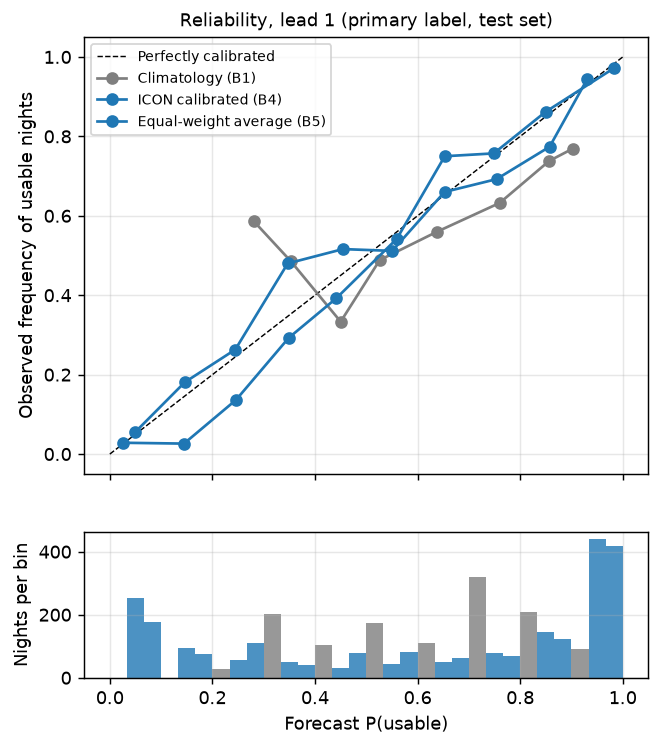
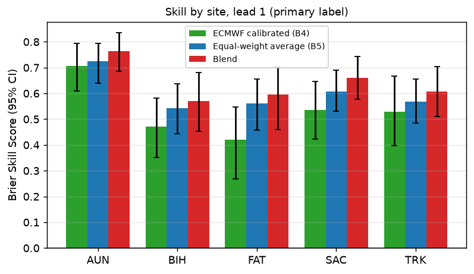

# Results

_Generated by `python -m skytrust report` from `artifacts/metrics.json` (evaluation run 2026-09-25T06:02:22Z, commit `0e6a89e-dirty`). Do not edit by hand._

**Setup.** Train on nights 2024-01-01 → 2025-12-31; test on 2026-01-01 → 2026-09-23 (never used for fitting or tuning). Each method is scored on the same test nights per lead (at lead 1: 1241 site-nights over 38 weeks). 95% CIs from a block bootstrap that resamples whole ISO calendar weeks (1000 resamples, seed 20260101).

## Summary

- **The learned blend** has a Brier Skill Score of **0.627 [0.569, 0.676]** at lead 1 and a false-clear rate of **9.4% [7.0%, 12.2%]**. Versus the best single model (ECMWF calibrated (B4)): better (Brier difference -0.0270 [-0.0369, -0.0181], CI excludes zero). Versus the equal-weight average: better (Brier difference -0.0077 [-0.0134, -0.0012], CI excludes zero).
- Across leads, the blend beats the best single model with a 95% CI excluding zero at **7 of 7 leads**.
- Across leads, the blend beats the simple equal-weight average with a 95% CI excluding zero at **2 of 7 leads**. **At leads 2, 4, 5, 6, 7 it does not beat the simple equal-weight average.**
- At lead 1 (the night-before forecast), the **equal-weight average of 5 models** has a Brier Skill Score of **0.596 [0.540, 0.645]** relative to climatology. The best single calibrated model (ECMWF calibrated (B4), chosen by *training* cross-validation, never by test results) scores 0.515 [0.444, 0.581].
- The equal-weight average beats the best single model with a 95% CI excluding zero at **6 of 7 leads** (not significant at lead 7).
- False-clear rate at lead 1 (of nights called "go" at P ≥ 0.5, the share that were not usable): **13.2% [10.4%, 16.3%]** for the equal-weight average vs 36.6% [30.0%, 43.6%] for climatology.
- Skill decays with lead time: equal-weight BSS falls from 0.596 at lead 1 to 0.160 at lead 7, and its false-clear rate rises from 13.2% to 29.4%.
- Under the **ASOS-only label** the picture changes: equal-weight BSS at lead 1 is -0.439 [-0.790, -0.152]. The models forecast *total* cloud (including cirrus), while ASOS only reports cloud below 12,000 ft, so they're scored against a truth that ignores part of what they predict. A blend trained on that label learns the relationship directly and scores 0.340 [0.225, 0.434]. See the label sensitivity section.
- ⚠ ECMWF is the best single model (by training CV) under the **era5** label at lead(s) 2, 3, 4, 5, 6, 7. ERA5 is produced by ECMWF, so part of this may be shared model physics rather than real-world skill.
- ⚠ ECMWF is the best single model (by training CV) under the **primary** label at lead(s) 1, 2, 3, 4, 5, 6, 7. ERA5 is produced by ECMWF, so part of this may be shared model physics rather than real-world skill.

## 1. Headline: primary label, lead 1

| method | Brier ↓ | BSS ↑ | log loss ↓ | AUC ↑ | false-clear ↓ | miss rate ↓ |
|---|---|---|---|---|---|---|
| Climatology (B1) | 0.241 [0.216, 0.268] | 0.000 [0.000, 0.000] | 0.684 | 0.634 | 36.6% [30.0%, 43.6%] | 20.7% |
| Persistence (B2) | 0.336 [0.295, 0.385] | -0.392 [-0.543, -0.253] | – | – | 28.7% [22.9%, 35.6%] | 29.1% |
| GFS calibrated (B4) | 0.115 [0.097, 0.132] | 0.525 [0.458, 0.592] | 0.367 | 0.914 | 14.0% [10.8%, 17.4%] | 12.0% |
| HRRR calibrated (B4) | 0.139 [0.118, 0.160] | 0.423 [0.346, 0.497] | 0.435 | 0.880 | 16.9% [12.8%, 21.3%] | 18.1% |
| ECMWF calibrated (B4) | 0.117 [0.098, 0.137] | 0.515 [0.444, 0.581] | 0.377 | 0.920 | 12.5% [9.5%, 15.7%] | 15.2% |
| GEM calibrated (B4) | 0.146 [0.125, 0.168] | 0.395 [0.318, 0.471] | 0.454 | 0.851 | 23.9% [18.9%, 29.6%] | 4.7% |
| ICON calibrated (B4) | 0.119 [0.103, 0.137] | 0.509 [0.441, 0.565] | 0.376 | 0.912 | 14.8% [11.3%, 19.0%] | 12.4% |
| Equal-weight average (B5) | 0.098 [0.084, 0.112] | 0.596 [0.540, 0.645] | 0.332 | 0.937 | 13.2% [10.4%, 16.3%] | 9.0% |
| Blend | 0.090 [0.074, 0.106] | 0.627 [0.569, 0.676] | 0.293 | 0.948 | 9.4% [7.0%, 12.2%] | 11.3% |

BSS = 1 − Brier / Brier(climatology). Persistence is a hard yes/no, so it has no log loss or AUC.

### Hard yes/no forecasts: persistence (B2) and each model's own rule (B3), lead 1

| method (hard yes/no) | false-clear ↓ | miss rate ↓ | accuracy ↑ |
|---|---|---|---|
| Persistence (B2) | 28.7% [22.9%, 35.6%] | 29.1% [23.6%, 36.6%] | 66.4% [61.5%, 70.5%] |
| GFS rule (B3) | 15.7% [12.4%, 19.3%] | 11.5% [8.1%, 15.0%] | 83.7% [81.5%, 85.9%] |
| HRRR rule (B3) | 17.8% [13.6%, 22.0%] | 14.9% [10.7%, 19.8%] | 80.6% [77.1%, 83.9%] |
| ECMWF rule (B3) | 15.1% [12.1%, 18.2%] | 6.5% [4.3%, 8.7%] | 86.5% [84.3%, 88.6%] |
| GEM rule (B3) | 30.6% [24.7%, 36.7%] | 1.8% [0.9%, 2.8%] | 73.7% [69.4%, 78.1%] |
| ICON rule (B3) | 14.1% [10.8%, 18.1%] | 18.6% [14.7%, 22.9%] | 81.3% [78.8%, 83.9%] |

## 2. Skill vs lead time

**Brier Skill Score by lead (primary label)**

| method | L1 | L2 | L3 | L4 | L5 | L6 | L7 |
|---|---|---|---|---|---|---|---|
| Climatology (B1) | 0.000 | 0.000 | 0.000 | 0.000 | 0.000 | 0.000 | 0.000 |
| GFS calibrated (B4) | 0.525 | 0.419 | 0.354 | 0.305 | 0.220 | 0.215 | 0.064 |
| HRRR calibrated (B4) | 0.423 | – | – | – | – | – | – |
| ECMWF calibrated (B4) | 0.515 | 0.428 | 0.426 | 0.284 | 0.255 | 0.214 | 0.123 |
| GEM calibrated (B4) | 0.395 | 0.346 | 0.328 | 0.259 | 0.179 | 0.147 | 0.137 |
| ICON calibrated (B4) | 0.509 | 0.452 | 0.404 | 0.329 | 0.287 | 0.180 | – |
| Equal-weight average (B5) | 0.596 | 0.543 | 0.511 | 0.439 | 0.376 | 0.317 | 0.160 |
| Blend | 0.627 | 0.542 | 0.529 | 0.437 | 0.377 | 0.318 | 0.183 |

**False-clear rate by lead (primary label)**

| method | L1 | L2 | L3 | L4 | L5 | L6 | L7 |
|---|---|---|---|---|---|---|---|
| Climatology (B1) | 36.6% | 35.0% | 35.5% | 36.1% | 36.9% | 36.5% | 36.6% |
| GFS calibrated (B4) | 14.0% | 17.0% | 20.3% | 24.1% | 26.3% | 27.5% | 33.6% |
| HRRR calibrated (B4) | 16.9% | – | – | – | – | – | – |
| ECMWF calibrated (B4) | 12.5% | 14.9% | 17.7% | 20.4% | 23.2% | 24.5% | 28.0% |
| GEM calibrated (B4) | 23.9% | 24.4% | 24.6% | 27.2% | 29.8% | 30.7% | 31.5% |
| ICON calibrated (B4) | 14.8% | 16.2% | 16.8% | 21.2% | 22.3% | 27.2% | – |
| Equal-weight average (B5) | 13.2% | 16.4% | 18.0% | 20.7% | 22.2% | 23.5% | 29.4% |
| Blend | 9.4% | 12.3% | 14.6% | 17.3% | 20.2% | 23.2% | 27.5% |

## 3. Calibration

When a method says 70%, does it happen ~70% of the time? Points on the diagonal are well calibrated; bars show how many nights fall in each bin.

## 4. Paired comparisons (Brier difference, negative = A better)

| lead | A − B | Brier difference [95% CI] | A better in | significant |
|---|---|---|---|---|
| 1 | Blend − ECMWF calibrated (B4) | -0.0270 [-0.0369, -0.0181] | 100% of resamples | yes |
| 1 | Blend − Climatology (B1) | -0.1514 [-0.1745, -0.1295] | 100% of resamples | yes |
| 1 | Blend − Equal-weight average (B5) | -0.0077 [-0.0134, -0.0012] | 99% of resamples | yes |
| 1 | ECMWF calibrated (B4) − Climatology (B1) | -0.1244 [-0.1483, -0.1022] | 100% of resamples | yes |
| 1 | Equal-weight average (B5) − ECMWF calibrated (B4) | -0.0194 [-0.0323, -0.0064] | 100% of resamples | yes |
| 1 | Equal-weight average (B5) − Climatology (B1) | -0.1437 [-0.1677, -0.1219] | 100% of resamples | yes |
| 2 | Blend − ECMWF calibrated (B4) | -0.0273 [-0.0373, -0.0186] | 100% of resamples | yes |
| 2 | Blend − Climatology (B1) | -0.1302 [-0.1529, -0.1081] | 100% of resamples | yes |
| 2 | Blend − Equal-weight average (B5) | +0.0002 [-0.0073, +0.0076] | 50% of resamples | no |
| 2 | ECMWF calibrated (B4) − Climatology (B1) | -0.1029 [-0.1273, -0.0798] | 100% of resamples | yes |
| 2 | Equal-weight average (B5) − ECMWF calibrated (B4) | -0.0275 [-0.0407, -0.0150] | 100% of resamples | yes |
| 2 | Equal-weight average (B5) − Climatology (B1) | -0.1305 [-0.1539, -0.1080] | 100% of resamples | yes |
| 3 | Blend − ECMWF calibrated (B4) | -0.0246 [-0.0344, -0.0161] | 100% of resamples | yes |
| 3 | Blend − Climatology (B1) | -0.1264 [-0.1492, -0.1023] | 100% of resamples | yes |
| 3 | Blend − Equal-weight average (B5) | -0.0041 [-0.0079, -0.0001] | 98% of resamples | yes |
| 3 | ECMWF calibrated (B4) − Climatology (B1) | -0.1018 [-0.1234, -0.0809] | 100% of resamples | yes |
| 3 | Equal-weight average (B5) − ECMWF calibrated (B4) | -0.0205 [-0.0311, -0.0109] | 100% of resamples | yes |
| 3 | Equal-weight average (B5) − Climatology (B1) | -0.1223 [-0.1457, -0.0993] | 100% of resamples | yes |
| 4 | Blend − ECMWF calibrated (B4) | -0.0367 [-0.0458, -0.0275] | 100% of resamples | yes |
| 4 | Blend − Climatology (B1) | -0.1044 [-0.1274, -0.0797] | 100% of resamples | yes |
| 4 | Blend − Equal-weight average (B5) | +0.0003 [-0.0052, +0.0058] | 44% of resamples | no |
| 4 | ECMWF calibrated (B4) − Climatology (B1) | -0.0677 [-0.0910, -0.0452] | 100% of resamples | yes |
| 4 | Equal-weight average (B5) − ECMWF calibrated (B4) | -0.0370 [-0.0486, -0.0255] | 100% of resamples | yes |
| 4 | Equal-weight average (B5) − Climatology (B1) | -0.1047 [-0.1279, -0.0791] | 100% of resamples | yes |
| 5 | Blend − ECMWF calibrated (B4) | -0.0293 [-0.0383, -0.0217] | 100% of resamples | yes |
| 5 | Blend − Climatology (B1) | -0.0908 [-0.1151, -0.0682] | 100% of resamples | yes |
| 5 | Blend − Equal-weight average (B5) | -0.0003 [-0.0066, +0.0063] | 52% of resamples | no |
| 5 | ECMWF calibrated (B4) − Climatology (B1) | -0.0614 [-0.0864, -0.0381] | 100% of resamples | yes |
| 5 | Equal-weight average (B5) − ECMWF calibrated (B4) | -0.0290 [-0.0423, -0.0167] | 100% of resamples | yes |
| 5 | Equal-weight average (B5) − Climatology (B1) | -0.0905 [-0.1138, -0.0694] | 100% of resamples | yes |
| 6 | Blend − ECMWF calibrated (B4) | -0.0253 [-0.0368, -0.0145] | 100% of resamples | yes |
| 6 | Blend − Climatology (B1) | -0.0771 [-0.0966, -0.0586] | 100% of resamples | yes |
| 6 | Blend − Equal-weight average (B5) | -0.0003 [-0.0048, +0.0044] | 57% of resamples | no |
| 6 | ECMWF calibrated (B4) − Climatology (B1) | -0.0518 [-0.0720, -0.0332] | 100% of resamples | yes |
| 6 | Equal-weight average (B5) − ECMWF calibrated (B4) | -0.0250 [-0.0388, -0.0123] | 100% of resamples | yes |
| 6 | Equal-weight average (B5) − Climatology (B1) | -0.0768 [-0.0970, -0.0580] | 100% of resamples | yes |
| 7 | Blend − ECMWF calibrated (B4) | -0.0145 [-0.0239, -0.0047] | 100% of resamples | yes |
| 7 | Blend − Climatology (B1) | -0.0441 [-0.0639, -0.0237] | 100% of resamples | yes |
| 7 | Blend − Equal-weight average (B5) | -0.0056 [-0.0142, +0.0036] | 89% of resamples | no |
| 7 | ECMWF calibrated (B4) − Climatology (B1) | -0.0296 [-0.0462, -0.0114] | 100% of resamples | yes |
| 7 | Equal-weight average (B5) − ECMWF calibrated (B4) | -0.0089 [-0.0247, +0.0070] | 85% of resamples | no |
| 7 | Equal-weight average (B5) − Climatology (B1) | -0.0385 [-0.0618, -0.0143] | 100% of resamples | yes |

## 5. By site and season (primary label, lead 1)

| site | n | weeks | base rate | BSS blend | BSS equal-weight | BSS ECMWF calibrated (B4) | false-clear blend | false-clear equal-weight | false-clear climatology |
|---|---|---|---|---|---|---|---|---|---|
| AUN | 248 | 38 | 58.5% | 0.765 [0.687, 0.833] | 0.725 [0.645, 0.793] | 0.681 [0.581, 0.777] | 4.9% | 5.7% | 38.2% |
| BIH | 244 | 38 | 66.4% | 0.560 [0.443, 0.672] | 0.534 [0.435, 0.635] | 0.459 [0.329, 0.579] | 11.4% | 14.6% | 30.5% |
| FAT | 256 | 38 | 57.8% | 0.575 [0.456, 0.683] | 0.555 [0.457, 0.651] | 0.407 [0.264, 0.524] | 11.3% | 16.9% | 36.7% |
| SAC | 252 | 38 | 58.7% | 0.663 [0.587, 0.745] | 0.611 [0.534, 0.690] | 0.522 [0.405, 0.638] | 6.4% | 8.5% | 38.5% |
| TRK | 241 | 38 | 50.2% | 0.570 [0.462, 0.671] | 0.549 [0.458, 0.630] | 0.507 [0.372, 0.631] | 13.7% | 19.5% | 39.3% |

| season | n | weeks | base rate | BSS blend | BSS equal-weight | BSS ECMWF calibrated (B4) | false-clear blend | false-clear equal-weight | false-clear climatology |
|---|---|---|---|---|---|---|---|---|---|
| DJF | 285 | 9 | 37.9% | 0.652 [0.543, 0.767] | 0.629 [0.569, 0.699] | 0.489 [0.337, 0.668] | 11.5% | 14.4% | 56.0% |
| MAM | 422 | 14 | 54.5% | 0.621 [0.527, 0.712] | 0.591 [0.491, 0.687] | 0.508 [0.389, 0.621] | 12.9% | 17.8% | 47.1% |
| JJA | 454 | 14 | 70.9% | 0.654 [0.543, 0.754] | 0.594 [0.482, 0.698] | 0.592 [0.474, 0.687] | 7.3% | 11.0% | 29.1% |
| SON | 80 | 3 | 80.0% | 0.373 (too few weeks for a CI) | 0.482 (too few weeks for a CI) | 0.164 (too few weeks for a CI) | 5.1% | 4.8% | 20.0% |

Test seasons are partial (the test year starts in January and ends at the latest labeled night). Subsets spanning fewer than `min_weeks_for_ci` weeks (config) get no CI, because a bootstrap over so few weekly blocks is unreliable.

## 6. Sensitivity to the truth label

| BSS at lead 1 | primary | asos | era5 |
|---|---|---|---|
| Climatology (B1) | 0.000 [0.000, 0.000] | 0.000 [0.000, 0.000] | 0.000 [0.000, 0.000] |
| GFS calibrated (B4) | 0.525 [0.458, 0.592] | 0.200 [0.107, 0.279] | 0.576 [0.511, 0.638] |
| HRRR calibrated (B4) | 0.423 [0.346, 0.497] | 0.180 [0.076, 0.268] | 0.440 [0.368, 0.508] |
| ECMWF calibrated (B4) | 0.515 [0.444, 0.581] | 0.038 [-0.132, 0.167] | 0.567 [0.507, 0.626] |
| GEM calibrated (B4) | 0.395 [0.318, 0.471] | 0.365 [0.260, 0.451] | 0.395 [0.310, 0.469] |
| ICON calibrated (B4) | 0.509 [0.441, 0.565] | 0.274 [0.166, 0.366] | 0.499 [0.441, 0.556] |
| Equal-weight average (B5) | 0.596 [0.540, 0.645] | -0.439 [-0.790, -0.152] | 0.615 [0.567, 0.663] |
| Blend | 0.627 [0.569, 0.676] | 0.340 [0.225, 0.434] | 0.665 [0.617, 0.716] |
| (test base rate) | 58.3% | 83.5% | 62.0% |

## 7. Single-model tuning (training data only)

| lead | model | C | CV log loss (train only) | train rows | chosen as best single |
|---|---|---|---|---|---|
| 1 | GFS calibrated (B4) | 1 | 0.3730 | 3526 |  |
| 1 | HRRR calibrated (B4) | 0.01 | 0.4217 | 3521 |  |
| 1 | ECMWF calibrated (B4) | 0.316 | 0.3553 | 3451 | ✓ |
| 1 | GEM calibrated (B4) | 0.01 | 0.4502 | 3526 |  |
| 1 | ICON calibrated (B4) | 100 | 0.3709 | 3526 |  |
| 2 | GFS calibrated (B4) | 0.01 | 0.4235 | 3521 |  |
| 2 | ECMWF calibrated (B4) | 0.316 | 0.3830 | 3446 | ✓ |
| 2 | GEM calibrated (B4) | 0.01 | 0.4621 | 3521 |  |
| 2 | ICON calibrated (B4) | 0.01 | 0.4152 | 3521 |  |
| 3 | GFS calibrated (B4) | 0.01 | 0.4591 | 3516 |  |
| 3 | ECMWF calibrated (B4) | 0.316 | 0.4314 | 3441 | ✓ |
| 3 | GEM calibrated (B4) | 0.01 | 0.5080 | 3516 |  |
| 3 | ICON calibrated (B4) | 0.01 | 0.4535 | 3516 |  |
| 4 | GFS calibrated (B4) | 0.01 | 0.4874 | 3511 |  |
| 4 | ECMWF calibrated (B4) | 0.316 | 0.4466 | 3436 | ✓ |
| 4 | GEM calibrated (B4) | 0.00316 | 0.5206 | 3511 |  |
| 4 | ICON calibrated (B4) | 0.01 | 0.4670 | 3511 |  |
| 5 | GFS calibrated (B4) | 0.01 | 0.5108 | 3506 |  |
| 5 | ECMWF calibrated (B4) | 3.16 | 0.4666 | 3431 | ✓ |
| 5 | GEM calibrated (B4) | 0.01 | 0.5310 | 3506 |  |
| 5 | ICON calibrated (B4) | 0.01 | 0.5104 | 3506 |  |
| 6 | GFS calibrated (B4) | 0.01 | 0.5349 | 3501 |  |
| 6 | ECMWF calibrated (B4) | 1 | 0.5207 | 3426 | ✓ |
| 6 | GEM calibrated (B4) | 0.01 | 0.5561 | 3501 |  |
| 6 | ICON calibrated (B4) | 0.01 | 0.5305 | 3501 |  |
| 7 | GFS calibrated (B4) | 0.01 | 0.5660 | 3496 |  |
| 7 | ECMWF calibrated (B4) | 0.0316 | 0.5324 | 3423 | ✓ |
| 7 | GEM calibrated (B4) | 0.01 | 0.5679 | 3496 |  |

## 8. The blend: what it learned

One logistic regression per lead on every available model's features, the model spread, site, month, and dark hours. Tuned and calibration-checked on training years only, exported to JSON, and scored here through the numpy loader, i.e. exactly the file the app uses. Calibration is added only if the out-of-fold calibration error on the training folds exceeds the configured threshold.

| lead | BSS | false-clear | vs best single | vs equal-weight | models | C | OOF calibration error | isotonic applied |
|---|---|---|---|---|---|---|---|---|
| L1 | 0.627 [0.569, 0.676] | 9.4% [7.0%, 12.2%] | better (ECMWF) | better | GFS, HRRR, ECMWF, GEM, ICON | 0.1 | 0.021 | no |
| L2 | 0.542 [0.482, 0.602] | 12.3% [8.9%, 15.7%] | better (ECMWF) | not significantly different | GFS, ECMWF, GEM, ICON | 0.316 | 0.026 | no |
| L3 | 0.529 [0.468, 0.586] | 14.6% [11.3%, 18.3%] | better (ECMWF) | better | GFS, ECMWF, GEM, ICON | 0.01 | 0.038 | no |
| L4 | 0.437 [0.357, 0.509] | 17.3% [13.1%, 21.3%] | better (ECMWF) | not significantly different | GFS, ECMWF, GEM, ICON | 1 | 0.028 | no |
| L5 | 0.377 [0.303, 0.449] | 20.2% [15.4%, 24.8%] | better (ECMWF) | not significantly different | GFS, ECMWF, GEM, ICON | 0.1 | 0.028 | no |
| L6 | 0.318 [0.249, 0.387] | 23.2% [18.0%, 28.8%] | better (ECMWF) | not significantly different | GFS, ECMWF, GEM, ICON | 0.0316 | 0.029 | no |
| L7 | 0.183 [0.098, 0.264] | 27.5% [21.6%, 34.4%] | better (ECMWF) | not significantly different | GFS, ECMWF, GEM | 0.1 | 0.027 | no |

**How much the blend leans on each model** (share of absolute standardized coefficients on each model's three features; features are correlated, so read this as a rough guide):

| lead | GFS | HRRR | ECMWF | GEM | ICON |
|---|---|---|---|---|---|
| L1 | 15.5% | 10.4% | 28.1% | 22.8% | 23.2% |
| L2 | 22.5% | – | 25.6% | 18.2% | 33.7% |
| L3 | 24.4% | – | 27.0% | 23.1% | 25.5% |
| L4 | 47.8% | – | 25.8% | 13.3% | 13.1% |
| L5 | 23.4% | – | 29.5% | 20.3% | 26.8% |
| L6 | 29.7% | – | 23.0% | 21.8% | 25.4% |
| L7 | 21.0% | – | 54.5% | 24.4% | – |

At lead 1 the blend leans most on ECMWF (28%); at lead 7, on ECMWF (55%). The model-spread coefficient at lead 1 is -0.330: when the models disagree, the blend lowers its probability of a usable night.

**Largest standardized coefficients at lead 1** (positive = more likely usable):

| feature (largest effects first) | standardized coefficient |
|---|---|
| icon_mean_cover | -0.671 |
| ecmwf_mean_cover | -0.652 |
| gfs_mean_cover | -0.432 |
| site_FAT | -0.404 |
| gem_mean_cover | -0.354 |
| spread_frac_clear | -0.330 |
| gem_frac_clear | +0.307 |
| hrrr_longest_clear_run_frac | +0.259 |
| site_AUN | +0.243 |
| site_SAC | +0.229 |
| month_cos | +0.175 |
| ecmwf_longest_clear_run_frac | +0.169 |

## Caveats

- **One test year.** The test period is 2026 only (38 weeks of labeled nights), so intervals are wide-ish and a different year could rank close methods differently. The test-period base rate of usable nights is lower than in training at 4 of 5 sites (AUN, BIH, SAC, TRK).
- **ASOS can't see above 12,000 ft.** "CLR" at an automated station means no cloud *below* 12,000 ft; cirrus is invisible to it. The primary label adds ERA5 to catch it (FAT's human observers are the exception and do report high cloud).
- **ERA5 is a reanalysis, not an observation,** on a ~28 km grid, and it is produced by ECMWF. Where ECMWF looks best under an ERA5-based label, part of that may be shared model physics.
- **Point vs grid.** Forecasts and ERA5 are grid-cell values (3–28 km); ASOS is a single point. Mountain and valley sites (TRK, BIH, AUN) are where these differ most.
- **Lead 1 vs the live "tonight" forecast.** Lead-1 values were issued ~24 h before each hour; the live app shows fresher forecasts, so its tonight probability is slightly conservative relative to what the backtest measured.
- **Interpolated hours.** ECMWF 0.25° (and GFS beyond ~5 days) are 3-hourly upstream; Open-Meteo interpolates to hourly, which affects "consecutive clear hours" for those models.
- **Uncalibrated equal-weight average.** B5 uses the mean forecast clear fraction directly as a probability. It's a deliberately naive reference, yet it is hard to beat (see Summary).
