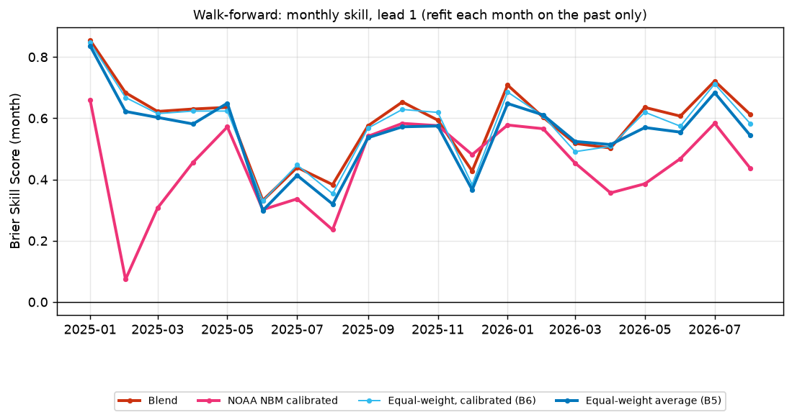

# Results

_Generated by `python -m skytrust report` from `artifacts/metrics.json` (evaluation run 2026-09-30T21:07:03Z, commit `ca566b3`). Do not edit by hand._

**Setup.** Train on nights 2024-01-01 → 2025-12-31; test on 2026-01-01 → 2026-08-31 (never used for fitting or tuning). Skill is measured against a long-term climatology (2004–2023, 19–20 usable years per site). Each method is scored on the same test nights per lead (at lead 1: 1111 site-nights over 35 weeks). 95% CIs from a block bootstrap that resamples whole ISO calendar weeks (1000 resamples, seed 20260101).

## Summary

- **The learned blend** has a Brier Skill Score of **0.613 [0.555, 0.670]** at lead 1 and a false-clear rate of **10.0% [7.4%, 12.8%]**. Versus the best single model (ECMWF calibrated (B4)): better (Brier difference -0.0280 [-0.0379, -0.0186], CI excludes zero). Versus the equal-weight average: better (Brier difference -0.0078 [-0.0134, -0.0017], CI excludes zero).
- **Versus NOAA's National Blend of Models (NBM)**, NOAA's own statistical blend, calibrated here with the same site/season context (BSS 0.484 [0.406, 0.562]): at lead 1 SkyTrust's blend is better (Brier difference -0.0304 [-0.0421, -0.0189], CI excludes zero). NBM's raw forecast used directly as a probability scores 0.442 [0.349, 0.534]; it isn't a calibrated probability, so the calibrated version is the fair comparison.
- **Would NBM help as an input?** A research variant of the blend that also sees NBM (trained only on the ~15 months NBM's archive covers) is not significantly different (Brier difference +0.0005 [-0.0031, +0.0037]) compared with the shipped blend at the same lead. The shipped model is unchanged either way, so the live forward test keeps scoring one fixed model.
- Across leads, the blend beats the best single model with a 95% CI excluding zero at **7 of 7 leads**.
- Across leads, the blend beats the simple equal-weight average with a 95% CI excluding zero at **2 of 7 leads**. **At leads 2, 4, 5, 6, 7 it does not beat the simple equal-weight average.**
- Across leads, the blend beats the calibrated equal-weight average (B6: same model, one shared weight) with a 95% CI excluding zero at **1 of 7 leads**. **At leads 2, 3, 4, 5, 6, 7 it does not beat the calibrated equal-weight average (B6: same model, one shared weight).**
- Across leads, the blend beats NOAA's calibrated NBM with a 95% CI excluding zero at **5 of 7 leads**. **At leads 5, 7 it does not beat NOAA's calibrated NBM.**
- **Where does the skill come from?** Measured step by step: averaging the models beats the best single model significantly at 6 of 7 leads; calibrating that average with site/season context (B6 vs B5) at 1 of 7; learning a separate weight per model (blend vs B6) at 1 of 7. Most of the value is simply combining several models, the *forecast combination puzzle*: a plain average is hard to beat with learned weights.
- **Checked against a satellite.** Judged by the GOES-18 cloud mask, an observation the shipped blend never trained on, it ranks nights with AUC 0.936 [0.909, 0.958] (NOAA NBM given the same treatment: 0.897 [0.861, 0.928]). When it says "go", the satellite shows a usable night 95.2% of the time (false-clear 4.8% [2.6%, 7.6%] vs 31.1% for climatology). Its Brier skill there, 0.440 [0.347, 0.538], is lower than under its own label because the satellite's definition is more lenient (usable on 68.3% of test nights vs 57.6%), so probabilities calibrated to the primary label run low; versus NBM on Brier it is not significantly different (Brier difference -0.0002 [-0.0103, +0.0112]). The Brier decomposition shows where the gap comes from: its resolution (0.123) nearly matches a blend trained on the satellite label (0.127), while its reliability (calibration) penalty is 0.034 vs 0.002.
- At lead 1 (the night-before forecast), the **equal-weight average of 5 models** has a Brier Skill Score of **0.580 [0.526, 0.635]** relative to climatology. The best single calibrated model (ECMWF calibrated (B4), chosen by *training* cross-validation, never by test results) scores 0.494 [0.426, 0.567].
- The equal-weight average beats the best single model with a 95% CI excluding zero at **6 of 7 leads** (not significant at lead 7).
- False-clear rate at lead 1 (of nights called "go" at P ≥ 0.5, the share that were not usable): **13.8% [11.1%, 16.7%]** for the equal-weight average vs 35.0% [28.2%, 42.9%] for climatology.
- Skill decays with lead time: equal-weight BSS falls from 0.580 at lead 1 to 0.134 at lead 7, and its false-clear rate rises from 13.8% to 30.6%.
- Under the **ASOS-only label** the picture changes: equal-weight BSS at lead 1 is -0.548 [-0.930, -0.229]. The models forecast *total* cloud (including cirrus), while ASOS only reports cloud below 12,000 ft, so they're scored against a truth that ignores part of what they predict. A blend trained on that label learns the relationship directly and scores 0.288 [0.190, 0.375]. See the label sensitivity section.
- ⚠ ECMWF is the best single model (by training CV) under the **era5** label at lead(s) 2, 3, 4, 5, 6, 7. ERA5 is produced by ECMWF, so part of this may be shared model physics rather than real-world skill.
- ⚠ ECMWF is the best single model (by training CV) under the **primary** label at lead(s) 1, 2, 3, 4, 5, 6, 7. ERA5 is produced by ECMWF, so part of this may be shared model physics rather than real-world skill.

## 1. Headline: primary label, lead 1

| method | Brier ↓ | BSS ↑ | log loss ↓ | AUC ↑ | false-clear ↓ | miss rate ↓ |
|---|---|---|---|---|---|---|
| Climatology (B1) | 0.235 [0.211, 0.259] | 0.000 [0.000, 0.000] | 0.664 | 0.632 | 35.0% [28.2%, 42.9%] | 28.4% |
| Climatology, training years (B1b) | 0.246 [0.217, 0.275] | -0.048 [-0.097, 0.003] | 0.695 | 0.630 | 37.5% [30.6%, 45.1%] | 23.3% |
| Persistence (B2) | 0.341 [0.291, 0.391] | -0.453 [-0.628, -0.290] | – | – | 29.7% [23.7%, 37.2%] | 29.4% |
| GFS calibrated (B4) | 0.116 [0.097, 0.134] | 0.508 [0.437, 0.574] | 0.370 | 0.913 | 14.7% [11.3%, 18.2%] | 11.7% |
| HRRR calibrated (B4) | 0.142 [0.119, 0.165] | 0.394 [0.314, 0.473] | 0.443 | 0.875 | 16.9% [13.2%, 21.1%] | 19.5% |
| ECMWF calibrated (B4) | 0.119 [0.098, 0.138] | 0.494 [0.426, 0.567] | 0.381 | 0.920 | 13.0% [10.0%, 16.5%] | 15.5% |
| GEM calibrated (B4) | 0.145 [0.123, 0.166] | 0.383 [0.303, 0.463] | 0.452 | 0.852 | 23.8% [18.4%, 29.3%] | 4.8% |
| ICON calibrated (B4) | 0.117 [0.098, 0.135] | 0.503 [0.439, 0.569] | 0.372 | 0.914 | 14.5% [10.5%, 18.5%] | 12.3% |
| NOAA NBM (raw) | 0.131 [0.107, 0.154] | 0.442 [0.349, 0.534] | 0.629 | 0.888 | 15.4% [11.3%, 19.6%] | 15.8% |
| NOAA NBM calibrated | 0.121 [0.101, 0.140] | 0.484 [0.406, 0.562] | 0.390 | 0.907 | 16.8% [12.6%, 21.1%] | 11.7% |
| Equal-weight average (B5) | 0.099 [0.084, 0.114] | 0.580 [0.526, 0.635] | 0.334 | 0.936 | 13.8% [11.1%, 16.7%] | 9.1% |
| Equal-weight, calibrated (B6) | 0.094 [0.079, 0.111] | 0.598 [0.541, 0.654] | 0.307 | 0.942 | 11.5% [8.8%, 14.4%] | 10.8% |
| Blend | 0.091 [0.075, 0.108] | 0.613 [0.555, 0.670] | 0.294 | 0.947 | 10.0% [7.4%, 12.8%] | 11.4% |
| Blend + NBM input (research) | 0.091 [0.076, 0.107] | 0.611 [0.556, 0.667] | 0.297 | 0.946 | 11.1% [8.5%, 13.7%] | 10.9% |

BSS = 1 − Brier / Brier(climatology). Persistence is a hard yes/no, so it has no log loss or AUC.

### Hard yes/no forecasts: persistence (B2) and each model's own rule (B3), lead 1

| method (hard yes/no) | false-clear ↓ | miss rate ↓ | accuracy ↑ |
|---|---|---|---|
| Persistence (B2) | 29.7% [23.7%, 37.2%] | 29.4% [23.4%, 36.6%] | 65.9% [60.9%, 70.9%] |
| GFS rule (B3) | 16.5% [13.1%, 20.2%] | 10.6% [7.4%, 14.3%] | 83.7% [81.6%, 86.1%] |
| HRRR rule (B3) | 18.2% [14.2%, 22.3%] | 15.8% [10.9%, 21.3%] | 80.1% [76.6%, 83.6%] |
| ECMWF rule (B3) | 15.3% [12.3%, 18.9%] | 6.4% [4.2%, 8.9%] | 86.6% [84.3%, 88.8%] |
| GEM rule (B3) | 31.0% [24.9%, 37.5%] | 1.7% [0.9%, 2.8%] | 73.6% [69.1%, 78.1%] |
| ICON rule (B3) | 14.0% [10.4%, 18.1%] | 18.1% [14.4%, 22.7%] | 81.9% [79.3%, 84.5%] |
| NOAA NBM rule | 15.3% [11.2%, 19.3%] | 10.0% [7.2%, 13.6%] | 84.9% [81.8%, 88.2%] |

## 2. Skill vs lead time

**Brier Skill Score by lead (primary label)**

| method | L1 | L2 | L3 | L4 | L5 | L6 | L7 |
|---|---|---|---|---|---|---|---|
| Climatology (B1) | 0.000 | 0.000 | 0.000 | 0.000 | 0.000 | 0.000 | 0.000 |
| Climatology, training years (B1b) | -0.048 | -0.045 | -0.042 | -0.042 | -0.043 | -0.046 | -0.042 |
| GFS calibrated (B4) | 0.508 | 0.400 | 0.336 | 0.284 | 0.195 | 0.179 | 0.030 |
| HRRR calibrated (B4) | 0.394 | – | – | – | – | – | – |
| ECMWF calibrated (B4) | 0.494 | 0.399 | 0.408 | 0.261 | 0.237 | 0.192 | 0.103 |
| GEM calibrated (B4) | 0.383 | 0.317 | 0.293 | 0.226 | 0.158 | 0.116 | 0.107 |
| ICON calibrated (B4) | 0.503 | 0.435 | 0.383 | 0.308 | 0.259 | 0.159 | – |
| NOAA NBM (raw) | 0.442 | 0.398 | 0.317 | 0.218 | 0.156 | 0.052 | -0.119 |
| NOAA NBM calibrated | 0.484 | 0.469 | 0.431 | 0.348 | 0.325 | 0.241 | 0.165 |
| Equal-weight average (B5) | 0.580 | 0.523 | 0.492 | 0.419 | 0.354 | 0.301 | 0.134 |
| Equal-weight, calibrated (B6) | 0.598 | 0.539 | 0.506 | 0.417 | 0.352 | 0.292 | 0.155 |
| Blend | 0.613 | 0.525 | 0.514 | 0.423 | 0.359 | 0.302 | 0.166 |
| Blend + NBM input (research) | 0.611 | 0.547 | 0.518 | 0.424 | 0.353 | 0.299 | 0.190 |

**False-clear rate by lead (primary label)**

| method | L1 | L2 | L3 | L4 | L5 | L6 | L7 |
|---|---|---|---|---|---|---|---|
| Climatology (B1) | 35.0% | 34.3% | 34.7% | 35.2% | 35.9% | 35.6% | 35.7% |
| Climatology, training years (B1b) | 37.5% | 36.5% | 37.1% | 37.8% | 38.5% | 38.1% | 38.3% |
| GFS calibrated (B4) | 14.7% | 17.7% | 20.9% | 24.9% | 27.1% | 28.5% | 34.9% |
| HRRR calibrated (B4) | 16.9% | – | – | – | – | – | – |
| ECMWF calibrated (B4) | 13.0% | 15.3% | 18.2% | 21.4% | 23.9% | 25.2% | 28.9% |
| GEM calibrated (B4) | 23.8% | 25.5% | 25.8% | 28.4% | 30.9% | 31.9% | 32.7% |
| ICON calibrated (B4) | 14.5% | 17.1% | 17.8% | 22.0% | 22.7% | 28.0% | – |
| NOAA NBM (raw) | 15.4% | 14.0% | 14.7% | 17.6% | 19.7% | 21.3% | 24.1% |
| NOAA NBM calibrated | 16.8% | 16.4% | 16.3% | 21.1% | 22.4% | 26.0% | 27.4% |
| Equal-weight average (B5) | 13.8% | 17.4% | 18.8% | 21.6% | 23.3% | 24.0% | 30.6% |
| Equal-weight, calibrated (B6) | 11.5% | 14.9% | 16.4% | 20.3% | 22.6% | 23.6% | 29.6% |
| Blend | 10.0% | 13.1% | 15.2% | 17.8% | 21.0% | 23.7% | 28.6% |
| Blend + NBM input (research) | 11.1% | 14.4% | 15.7% | 18.8% | 21.8% | 24.8% | 27.9% |

## 3. Calibration

When a method says 70%, does it happen ~70% of the time? Points on the diagonal are well calibrated; bars show how many nights fall in each bin.

## 4. Paired comparisons (Brier difference, negative = A better)

| lead | A − B | Brier difference [95% CI] | A better in | significant |
|---|---|---|---|---|
| 1 | Blend − ECMWF calibrated (B4) | -0.0280 [-0.0379, -0.0186] | 100% of resamples | yes |
| 1 | Blend − Climatology (B1) | -0.1441 [-0.1651, -0.1257] | 100% of resamples | yes |
| 1 | Blend − Equal-weight average (B5) | -0.0078 [-0.0134, -0.0017] | 100% of resamples | yes |
| 1 | Blend − NOAA NBM calibrated | -0.0304 [-0.0421, -0.0189] | 100% of resamples | yes |
| 1 | Blend − NOAA NBM (raw) | -0.0402 [-0.0545, -0.0265] | 100% of resamples | yes |
| 1 | NOAA NBM calibrated − Climatology (B1) | -0.1136 [-0.1373, -0.0917] | 100% of resamples | yes |
| 1 | Blend + NBM input (research) − Blend | +0.0005 [-0.0031, +0.0037] | 40% of resamples | no |
| 1 | Blend + NBM input (research) − NOAA NBM calibrated | -0.0299 [-0.0390, -0.0206] | 100% of resamples | yes |
| 1 | Blend − Equal-weight, calibrated (B6) | -0.0037 [-0.0066, -0.0009] | 99% of resamples | yes |
| 1 | Equal-weight, calibrated (B6) − Equal-weight average (B5) | -0.0041 [-0.0081, -0.0002] | 98% of resamples | yes |
| 1 | ECMWF calibrated (B4) − Climatology (B1) | -0.1161 [-0.1362, -0.0975] | 100% of resamples | yes |
| 1 | Equal-weight average (B5) − ECMWF calibrated (B4) | -0.0202 [-0.0325, -0.0080] | 100% of resamples | yes |
| 1 | Equal-weight average (B5) − Climatology (B1) | -0.1363 [-0.1576, -0.1172] | 100% of resamples | yes |
| 2 | Blend − ECMWF calibrated (B4) | -0.0296 [-0.0386, -0.0208] | 100% of resamples | yes |
| 2 | Blend − Climatology (B1) | -0.1231 [-0.1430, -0.1031] | 100% of resamples | yes |
| 2 | Blend − Equal-weight average (B5) | -0.0005 [-0.0081, +0.0074] | 56% of resamples | no |
| 2 | Blend − NOAA NBM calibrated | -0.0132 [-0.0246, -0.0005] | 98% of resamples | yes |
| 2 | Blend − NOAA NBM (raw) | -0.0297 [-0.0431, -0.0160] | 100% of resamples | yes |
| 2 | NOAA NBM calibrated − Climatology (B1) | -0.1099 [-0.1293, -0.0901] | 100% of resamples | yes |
| 2 | Blend + NBM input (research) − Blend | -0.0051 [-0.0112, +0.0004] | 97% of resamples | no |
| 2 | Blend + NBM input (research) − NOAA NBM calibrated | -0.0183 [-0.0255, -0.0104] | 100% of resamples | yes |
| 2 | Blend − Equal-weight, calibrated (B6) | +0.0033 [-0.0016, +0.0081] | 10% of resamples | no |
| 2 | Equal-weight, calibrated (B6) − Equal-weight average (B5) | -0.0038 [-0.0084, +0.0006] | 95% of resamples | no |
| 2 | ECMWF calibrated (B4) − Climatology (B1) | -0.0935 [-0.1153, -0.0735] | 100% of resamples | yes |
| 2 | Equal-weight average (B5) − ECMWF calibrated (B4) | -0.0291 [-0.0430, -0.0166] | 100% of resamples | yes |
| 2 | Equal-weight average (B5) − Climatology (B1) | -0.1226 [-0.1420, -0.1035] | 100% of resamples | yes |
| 3 | Blend − ECMWF calibrated (B4) | -0.0249 [-0.0350, -0.0165] | 100% of resamples | yes |
| 3 | Blend − Climatology (B1) | -0.1203 [-0.1411, -0.0993] | 100% of resamples | yes |
| 3 | Blend − Equal-weight average (B5) | -0.0052 [-0.0091, -0.0010] | 100% of resamples | yes |
| 3 | Blend − NOAA NBM calibrated | -0.0194 [-0.0310, -0.0083] | 100% of resamples | yes |
| 3 | Blend − NOAA NBM (raw) | -0.0460 [-0.0642, -0.0295] | 100% of resamples | yes |
| 3 | NOAA NBM calibrated − Climatology (B1) | -0.1009 [-0.1214, -0.0808] | 100% of resamples | yes |
| 3 | Blend + NBM input (research) − Blend | -0.0008 [-0.0051, +0.0035] | 64% of resamples | no |
| 3 | Blend + NBM input (research) − NOAA NBM calibrated | -0.0202 [-0.0287, -0.0124] | 100% of resamples | yes |
| 3 | Blend − Equal-weight, calibrated (B6) | -0.0019 [-0.0040, +0.0001] | 96% of resamples | no |
| 3 | Equal-weight, calibrated (B6) − Equal-weight average (B5) | -0.0032 [-0.0076, +0.0011] | 92% of resamples | no |
| 3 | ECMWF calibrated (B4) − Climatology (B1) | -0.0954 [-0.1160, -0.0749] | 100% of resamples | yes |
| 3 | Equal-weight average (B5) − ECMWF calibrated (B4) | -0.0198 [-0.0317, -0.0095] | 100% of resamples | yes |
| 3 | Equal-weight average (B5) − Climatology (B1) | -0.1152 [-0.1358, -0.0952] | 100% of resamples | yes |
| 4 | Blend − ECMWF calibrated (B4) | -0.0378 [-0.0467, -0.0278] | 100% of resamples | yes |
| 4 | Blend − Climatology (B1) | -0.0989 [-0.1211, -0.0758] | 100% of resamples | yes |
| 4 | Blend − Equal-weight average (B5) | -0.0010 [-0.0070, +0.0051] | 66% of resamples | no |
| 4 | Blend − NOAA NBM calibrated | -0.0176 [-0.0287, -0.0075] | 100% of resamples | yes |
| 4 | Blend − NOAA NBM (raw) | -0.0480 [-0.0655, -0.0325] | 100% of resamples | yes |
| 4 | NOAA NBM calibrated − Climatology (B1) | -0.0813 [-0.1032, -0.0584] | 100% of resamples | yes |
| 4 | Blend + NBM input (research) − Blend | -0.0001 [-0.0051, +0.0049] | 53% of resamples | no |
| 4 | Blend + NBM input (research) − NOAA NBM calibrated | -0.0177 [-0.0246, -0.0112] | 100% of resamples | yes |
| 4 | Blend − Equal-weight, calibrated (B6) | -0.0015 [-0.0053, +0.0022] | 79% of resamples | no |
| 4 | Equal-weight, calibrated (B6) − Equal-weight average (B5) | +0.0005 [-0.0036, +0.0044] | 43% of resamples | no |
| 4 | ECMWF calibrated (B4) − Climatology (B1) | -0.0611 [-0.0836, -0.0382] | 100% of resamples | yes |
| 4 | Equal-weight average (B5) − ECMWF calibrated (B4) | -0.0368 [-0.0487, -0.0239] | 100% of resamples | yes |
| 4 | Equal-weight average (B5) − Climatology (B1) | -0.0979 [-0.1201, -0.0753] | 100% of resamples | yes |
| 5 | Blend − ECMWF calibrated (B4) | -0.0286 [-0.0379, -0.0206] | 100% of resamples | yes |
| 5 | Blend − Climatology (B1) | -0.0844 [-0.1058, -0.0664] | 100% of resamples | yes |
| 5 | Blend − Equal-weight average (B5) | -0.0012 [-0.0072, +0.0055] | 66% of resamples | no |
| 5 | Blend − NOAA NBM calibrated | -0.0079 [-0.0203, +0.0039] | 89% of resamples | no |
| 5 | Blend − NOAA NBM (raw) | -0.0478 [-0.0704, -0.0242] | 100% of resamples | yes |
| 5 | NOAA NBM calibrated − Climatology (B1) | -0.0765 [-0.0979, -0.0559] | 100% of resamples | yes |
| 5 | Blend + NBM input (research) − Blend | +0.0015 [-0.0038, +0.0070] | 32% of resamples | no |
| 5 | Blend + NBM input (research) − NOAA NBM calibrated | -0.0064 [-0.0148, +0.0014] | 95% of resamples | no |
| 5 | Blend − Equal-weight, calibrated (B6) | -0.0017 [-0.0056, +0.0022] | 80% of resamples | no |
| 5 | Equal-weight, calibrated (B6) − Equal-weight average (B5) | +0.0005 [-0.0036, +0.0047] | 42% of resamples | no |
| 5 | ECMWF calibrated (B4) − Climatology (B1) | -0.0558 [-0.0786, -0.0351] | 100% of resamples | yes |
| 5 | Equal-weight average (B5) − ECMWF calibrated (B4) | -0.0274 [-0.0412, -0.0153] | 100% of resamples | yes |
| 5 | Equal-weight average (B5) − Climatology (B1) | -0.0832 [-0.1052, -0.0636] | 100% of resamples | yes |
| 6 | Blend − ECMWF calibrated (B4) | -0.0260 [-0.0380, -0.0144] | 100% of resamples | yes |
| 6 | Blend − Climatology (B1) | -0.0714 [-0.0901, -0.0535] | 100% of resamples | yes |
| 6 | Blend − Equal-weight average (B5) | -0.0004 [-0.0050, +0.0040] | 54% of resamples | no |
| 6 | Blend − NOAA NBM calibrated | -0.0145 [-0.0244, -0.0043] | 100% of resamples | yes |
| 6 | Blend − NOAA NBM (raw) | -0.0591 [-0.0832, -0.0363] | 100% of resamples | yes |
| 6 | NOAA NBM calibrated − Climatology (B1) | -0.0570 [-0.0781, -0.0367] | 100% of resamples | yes |
| 6 | Blend + NBM input (research) − Blend | +0.0008 [-0.0034, +0.0051] | 38% of resamples | no |
| 6 | Blend + NBM input (research) − NOAA NBM calibrated | -0.0137 [-0.0200, -0.0074] | 100% of resamples | yes |
| 6 | Blend − Equal-weight, calibrated (B6) | -0.0023 [-0.0051, +0.0000] | 97% of resamples | no |
| 6 | Equal-weight, calibrated (B6) − Equal-weight average (B5) | +0.0019 [-0.0024, +0.0056] | 15% of resamples | no |
| 6 | ECMWF calibrated (B4) − Climatology (B1) | -0.0455 [-0.0657, -0.0259] | 100% of resamples | yes |
| 6 | Equal-weight average (B5) − ECMWF calibrated (B4) | -0.0255 [-0.0393, -0.0128] | 100% of resamples | yes |
| 6 | Equal-weight average (B5) − Climatology (B1) | -0.0710 [-0.0892, -0.0529] | 100% of resamples | yes |
| 7 | Blend − ECMWF calibrated (B4) | -0.0149 [-0.0239, -0.0065] | 100% of resamples | yes |
| 7 | Blend − Climatology (B1) | -0.0392 [-0.0605, -0.0163] | 100% of resamples | yes |
| 7 | Blend − Equal-weight average (B5) | -0.0076 [-0.0167, +0.0015] | 94% of resamples | no |
| 7 | Blend − NOAA NBM calibrated | -0.0003 [-0.0113, +0.0104] | 49% of resamples | no |
| 7 | Blend − NOAA NBM (raw) | -0.0673 [-0.0919, -0.0414] | 100% of resamples | yes |
| 7 | NOAA NBM calibrated − Climatology (B1) | -0.0389 [-0.0593, -0.0177] | 100% of resamples | yes |
| 7 | Blend + NBM input (research) − Blend | -0.0054 [-0.0111, +0.0000] | 97% of resamples | no |
| 7 | Blend + NBM input (research) − NOAA NBM calibrated | -0.0057 [-0.0116, +0.0002] | 97% of resamples | no |
| 7 | Blend − Equal-weight, calibrated (B6) | -0.0027 [-0.0086, +0.0027] | 83% of resamples | no |
| 7 | Equal-weight, calibrated (B6) − Equal-weight average (B5) | -0.0049 [-0.0118, +0.0018] | 93% of resamples | no |
| 7 | ECMWF calibrated (B4) − Climatology (B1) | -0.0243 [-0.0442, -0.0038] | 99% of resamples | yes |
| 7 | Equal-weight average (B5) − ECMWF calibrated (B4) | -0.0073 [-0.0229, +0.0077] | 79% of resamples | no |
| 7 | Equal-weight average (B5) − Climatology (B1) | -0.0316 [-0.0554, -0.0056] | 99% of resamples | yes |

## 5. By site and season (primary label, lead 1)

| site | n | weeks | base rate | BSS blend | BSS equal-weight | BSS ECMWF calibrated (B4) | false-clear blend | false-clear equal-weight | false-clear climatology |
|---|---|---|---|---|---|---|---|---|---|
| AUN | 222 | 35 | 58.6% | 0.740 [0.659, 0.815] | 0.702 [0.624, 0.772] | 0.674 [0.571, 0.776] | 5.5% | 6.4% | 33.8% |
| BIH | 218 | 35 | 64.7% | 0.540 [0.416, 0.648] | 0.516 [0.415, 0.609] | 0.424 [0.303, 0.540] | 12.3% | 15.9% | 35.3% |
| FAT | 230 | 35 | 56.5% | 0.579 [0.465, 0.683] | 0.557 [0.461, 0.649] | 0.401 [0.267, 0.520] | 12.0% | 17.2% | 36.6% |
| SAC | 226 | 35 | 58.0% | 0.632 [0.543, 0.726] | 0.578 [0.492, 0.663] | 0.493 [0.375, 0.608] | 6.5% | 8.8% | 34.8% |
| TRK | 215 | 35 | 50.2% | 0.580 [0.463, 0.694] | 0.551 [0.447, 0.653] | 0.489 [0.332, 0.633] | 13.9% | 19.7% | 34.4% |

| season | n | weeks | base rate | BSS blend | BSS equal-weight | BSS ECMWF calibrated (B4) | false-clear blend | false-clear equal-weight | false-clear climatology |
|---|---|---|---|---|---|---|---|---|---|
| DJF | 285 | 9 | 37.9% | 0.655 [0.529, 0.786] | 0.632 [0.555, 0.720] | 0.493 [0.331, 0.681] | 11.5% | 14.4% | 50.9% |
| MAM | 372 | 13 | 56.5% | 0.552 [0.456, 0.640] | 0.539 [0.429, 0.637] | 0.407 [0.310, 0.507] | 13.7% | 17.8% | 44.3% |
| JJA | 454 | 14 | 70.9% | 0.646 [0.549, 0.742] | 0.585 [0.485, 0.685] | 0.583 [0.488, 0.674] | 7.3% | 11.0% | 29.1% |

Test seasons are partial (the test period is Jan–Aug 2026). Subsets spanning fewer than `min_weeks_for_ci` weeks (config) get no CI, because a bootstrap over so few weekly blocks is unreliable.

## 6. Sensitivity to the truth label

| BSS at lead 1 | primary | asos | era5 | goes |
|---|---|---|---|---|
| Climatology (B1) | 0.000 [0.000, 0.000] | 0.000 [0.000, 0.000] | 0.000 [0.000, 0.000] | 0.000 [0.000, 0.000] |
| Climatology, training years (B1b) | -0.048 [-0.097, 0.003] | -0.075 [-0.150, 0.003] | -0.044 [-0.089, 0.004] | – |
| GFS calibrated (B4) | 0.508 [0.437, 0.574] | 0.148 [0.071, 0.220] | 0.574 [0.498, 0.640] | 0.499 [0.423, 0.578] |
| HRRR calibrated (B4) | 0.394 [0.314, 0.473] | 0.123 [0.033, 0.197] | 0.421 [0.340, 0.496] | 0.435 [0.347, 0.526] |
| ECMWF calibrated (B4) | 0.494 [0.426, 0.567] | -0.026 [-0.158, 0.098] | 0.553 [0.494, 0.610] | 0.461 [0.398, 0.530] |
| GEM calibrated (B4) | 0.383 [0.303, 0.463] | 0.313 [0.221, 0.395] | 0.387 [0.295, 0.475] | 0.468 [0.385, 0.554] |
| ICON calibrated (B4) | 0.503 [0.439, 0.569] | 0.224 [0.135, 0.304] | 0.494 [0.427, 0.552] | 0.508 [0.423, 0.590] |
| NOAA NBM (raw) | 0.442 [0.349, 0.534] | -0.963 [-1.433, -0.551] | 0.432 [0.323, 0.520] | 0.326 [0.197, 0.448] |
| NOAA NBM calibrated | 0.484 [0.406, 0.562] | 0.300 [0.216, 0.374] | 0.488 [0.401, 0.562] | 0.503 [0.422, 0.582] |
| Equal-weight average (B5) | 0.580 [0.526, 0.635] | -0.548 [-0.930, -0.229] | 0.609 [0.555, 0.657] | 0.523 [0.450, 0.606] |
| Equal-weight, calibrated (B6) | 0.598 [0.541, 0.654] | 0.239 [0.144, 0.316] | 0.630 [0.567, 0.688] | 0.595 [0.523, 0.670] |
| Blend | 0.613 [0.555, 0.670] | 0.288 [0.190, 0.375] | 0.659 [0.604, 0.714] | 0.602 [0.528, 0.678] |
| Blend + NBM input (research) | 0.611 [0.556, 0.667] | 0.315 [0.210, 0.402] | 0.659 [0.602, 0.712] | 0.600 [0.528, 0.676] |
| (test base rate) | 57.6% | 83.0% | 61.4% | 68.3% |

**Cross-truth check.** The shipped blend is trained on the primary label only. Scoring that same model against truths it never trained on tests whether its skill is an artifact of how the primary label is built. NOAA's NBM gets the same treatment (calibrated on primary), so neither model is fitted to the judging truth. AUC measures how well nights are *ranked* and is unaffected by a label's base rate; Brier skill also charges for probabilities calibrated to the primary label's stricter base rate, so a model trained on primary is expected to look conservative under a more lenient truth. GOES is the most independent: a satellite observation, not a model, that also sees the high cloud ASOS can't. Its climatology is its own 2024–25 training-years rate (there is no 20-year satellite record).

| judged by (lead 1) | base rate | AUC shipped blend | AUC NBM (primary) | BSS shipped blend | BSS NBM (primary) | BSS blend trained on this label | false-clear shipped blend | false-clear climatology | shipped blend vs NBM (Brier) |
|---|---|---|---|---|---|---|---|---|---|
| ASOS-only | 83.0% | 0.864 [0.834, 0.891] | 0.872 [0.836, 0.901] | -0.831 [-1.309, -0.469] | -0.388 [-0.682, -0.111] | 0.288 [0.190, 0.375] | 3.3% | 16.0% | worse (Brier difference +0.0583 [+0.0428, +0.0768], CI excludes zero) |
| ERA5-only | 61.4% | 0.953 [0.936, 0.966] | 0.906 [0.870, 0.935] | 0.602 [0.534, 0.665] | 0.481 [0.391, 0.551] | 0.659 [0.604, 0.714] | 6.5% | 32.3% | better (Brier difference -0.0276 [-0.0411, -0.0155], CI excludes zero) |
| GOES satellite | 68.3% | 0.936 [0.909, 0.958] | 0.897 [0.861, 0.928] | 0.440 [0.347, 0.538] | 0.439 [0.353, 0.527] | 0.602 [0.528, 0.678] | 4.8% | 31.1% | not significantly different (Brier difference -0.0002 [-0.0103, +0.0112]) |

## 7. Single-model tuning (training data only)

| lead | model | C | CV log loss (train only) | train rows | chosen as best single |
|---|---|---|---|---|---|
| 1 | GFS calibrated (B4) | 1 | 0.3730 | 3526 |  |
| 1 | HRRR calibrated (B4) | 0.01 | 0.4217 | 3521 |  |
| 1 | ECMWF calibrated (B4) | 0.316 | 0.3553 | 3451 | ✓ |
| 1 | GEM calibrated (B4) | 0.01 | 0.4502 | 3526 |  |
| 1 | ICON calibrated (B4) | 100 | 0.3709 | 3526 |  |
| 1 | NOAA NBM calibrated | 0.01 | 0.3950 | 2221 |  |
| 1 | Equal-weight, calibrated (B6) | 0.1 | 0.2933 | 3446 |  |
| 1 | Blend + NBM input (research) | 0.01 | 0.2996 | 2221 |  |
| 2 | GFS calibrated (B4) | 0.01 | 0.4235 | 3521 |  |
| 2 | ECMWF calibrated (B4) | 0.316 | 0.3830 | 3446 | ✓ |
| 2 | GEM calibrated (B4) | 0.01 | 0.4621 | 3521 |  |
| 2 | ICON calibrated (B4) | 0.01 | 0.4152 | 3521 |  |
| 2 | NOAA NBM calibrated | 0.01 | 0.4096 | 2216 |  |
| 2 | Equal-weight, calibrated (B6) | 0.316 | 0.3180 | 3446 |  |
| 2 | Blend + NBM input (research) | 0.01 | 0.3275 | 2216 |  |
| 3 | GFS calibrated (B4) | 0.01 | 0.4591 | 3516 |  |
| 3 | ECMWF calibrated (B4) | 0.316 | 0.4314 | 3441 | ✓ |
| 3 | GEM calibrated (B4) | 0.01 | 0.5080 | 3516 |  |
| 3 | ICON calibrated (B4) | 0.01 | 0.4535 | 3516 |  |
| 3 | NOAA NBM calibrated | 0.01 | 0.4502 | 2211 |  |
| 3 | Equal-weight, calibrated (B6) | 3.16 | 0.3612 | 3441 |  |
| 3 | Blend + NBM input (research) | 0.01 | 0.3709 | 2211 |  |
| 4 | GFS calibrated (B4) | 0.01 | 0.4874 | 3511 |  |
| 4 | ECMWF calibrated (B4) | 0.316 | 0.4466 | 3436 | ✓ |
| 4 | GEM calibrated (B4) | 0.00316 | 0.5206 | 3511 |  |
| 4 | ICON calibrated (B4) | 0.01 | 0.4670 | 3511 |  |
| 4 | NOAA NBM calibrated | 0.01 | 0.4709 | 2206 |  |
| 4 | Equal-weight, calibrated (B6) | 0.316 | 0.3878 | 3436 |  |
| 4 | Blend + NBM input (research) | 0.01 | 0.3944 | 2206 |  |
| 5 | GFS calibrated (B4) | 0.01 | 0.5108 | 3506 |  |
| 5 | ECMWF calibrated (B4) | 3.16 | 0.4666 | 3431 | ✓ |
| 5 | GEM calibrated (B4) | 0.01 | 0.5310 | 3506 |  |
| 5 | ICON calibrated (B4) | 0.01 | 0.5104 | 3506 |  |
| 5 | NOAA NBM calibrated | 0.1 | 0.4568 | 2201 |  |
| 5 | Equal-weight, calibrated (B6) | 1 | 0.4192 | 3431 |  |
| 5 | Blend + NBM input (research) | 0.01 | 0.4328 | 2201 |  |
| 6 | GFS calibrated (B4) | 0.01 | 0.5349 | 3501 |  |
| 6 | ECMWF calibrated (B4) | 1 | 0.5207 | 3426 | ✓ |
| 6 | GEM calibrated (B4) | 0.01 | 0.5561 | 3501 |  |
| 6 | ICON calibrated (B4) | 0.01 | 0.5305 | 3501 |  |
| 6 | NOAA NBM calibrated | 0.316 | 0.5191 | 2196 |  |
| 6 | Equal-weight, calibrated (B6) | 0.316 | 0.4680 | 3426 |  |
| 6 | Blend + NBM input (research) | 0.00316 | 0.4882 | 2196 |  |
| 7 | GFS calibrated (B4) | 0.01 | 0.5660 | 3496 |  |
| 7 | ECMWF calibrated (B4) | 0.0316 | 0.5324 | 3423 | ✓ |
| 7 | GEM calibrated (B4) | 0.01 | 0.5679 | 3496 |  |
| 7 | NOAA NBM calibrated | 0.01 | 0.5674 | 2191 |  |
| 7 | Equal-weight, calibrated (B6) | 1 | 0.5083 | 3423 |  |
| 7 | Blend + NBM input (research) | 0.00316 | 0.5312 | 2191 |  |

## 8. The blend: what it learned

One logistic regression per lead on every available model's features, the model spread, site, month, and dark hours. Tuned and calibration-checked on training years only, exported to JSON, and scored here through the numpy loader, i.e. exactly the file the app uses. Calibration is added only if the out-of-fold calibration error on the training folds exceeds the configured threshold.

| lead | BSS | false-clear | vs best single | vs equal-weight | models | C | OOF calibration error | isotonic applied |
|---|---|---|---|---|---|---|---|---|
| L1 | 0.613 [0.555, 0.670] | 10.0% [7.4%, 12.8%] | better (ECMWF) | better | GFS, HRRR, ECMWF, GEM, ICON | 0.1 | 0.021 | no |
| L2 | 0.525 [0.458, 0.593] | 13.1% [9.8%, 16.7%] | better (ECMWF) | not significantly different | GFS, ECMWF, GEM, ICON | 0.316 | 0.026 | no |
| L3 | 0.514 [0.450, 0.575] | 15.2% [11.6%, 19.1%] | better (ECMWF) | better | GFS, ECMWF, GEM, ICON | 0.01 | 0.038 | no |
| L4 | 0.423 [0.337, 0.505] | 17.8% [13.6%, 22.1%] | better (ECMWF) | not significantly different | GFS, ECMWF, GEM, ICON | 1 | 0.028 | no |
| L5 | 0.359 [0.289, 0.444] | 21.0% [16.1%, 26.0%] | better (ECMWF) | not significantly different | GFS, ECMWF, GEM, ICON | 0.1 | 0.028 | no |
| L6 | 0.302 [0.229, 0.376] | 23.7% [18.5%, 30.1%] | better (ECMWF) | not significantly different | GFS, ECMWF, GEM, ICON | 0.0316 | 0.029 | no |
| L7 | 0.166 [0.067, 0.261] | 28.6% [21.9%, 35.9%] | better (ECMWF) | not significantly different | GFS, ECMWF, GEM | 0.1 | 0.027 | no |

**How much the blend leans on each model** (share of absolute standardized coefficients on each model's three features; features are correlated, so read this as a rough guide):

| lead | GFS | HRRR | ECMWF | GEM | ICON |
|---|---|---|---|---|---|
| L1 | 15.5% | 10.4% | 28.1% | 22.8% | 23.2% |
| L2 | 22.5% | – | 25.6% | 18.2% | 33.7% |
| L3 | 24.4% | – | 27.0% | 23.1% | 25.5% |
| L4 | 47.8% | – | 25.8% | 13.3% | 13.1% |
| L5 | 23.4% | – | 29.5% | 20.3% | 26.8% |
| L6 | 29.7% | – | 23.0% | 21.8% | 25.4% |
| L7 | 21.0% | – | 54.5% | 24.4% | – |

At lead 1 the blend leans most on ECMWF (28%); at lead 7, on ECMWF (55%). The model-spread coefficient at lead 1 is -0.330: when the models disagree, the blend lowers its probability of a usable night.

**Largest standardized coefficients at lead 1** (positive = more likely usable):

| feature (largest effects first) | standardized coefficient |
|---|---|
| icon_mean_cover | -0.671 |
| ecmwf_mean_cover | -0.652 |
| gfs_mean_cover | -0.432 |
| site_FAT | -0.404 |
| gem_mean_cover | -0.354 |
| spread_frac_clear | -0.330 |
| gem_frac_clear | +0.307 |
| hrrr_longest_clear_run_frac | +0.259 |
| site_AUN | +0.243 |
| site_SAC | +0.229 |
| month_cos | +0.175 |
| ecmwf_longest_clear_run_frac | +0.169 |

## 9. Decision value and forecast quality

Skill scores don't say whether a forecast is worth acting on. The cost-loss model does: setting up costs effort C; skipping a usable night loses L. With α = C/L, a calibrated user goes out when P ≥ α. *Relative value* is the share of a perfect forecast's benefit (over the best fixed habit: always go, or never go) that acting on the forecast delivers.

| share of a perfect forecast's value | α = 0.1 | α = 0.2 | α = 0.3 | α = 0.5 |
|---|---|---|---|---|
| Blend | 36.9% | 52.4% | 56.1% | 71.1% |
| NOAA NBM calibrated | 19.5% | 36.3% | 47.0% | 59.9% |
| Equal-weight, calibrated (B6) | 33.5% | 52.4% | 56.2% | 69.6% |
| Equal-weight average (B5) | 24.4% | 44.2% | 56.7% | 67.9% |
| ECMWF calibrated (B4) | 25.5% | 29.3% | 40.6% | 61.8% |

For an astrophotographer whose good night is worth 5× the setup effort (α = 0.2), acting on SkyTrust's night-before probability captures 52% of the value of a perfect forecast, versus 36% for NOAA's calibrated NBM. Where a curve drops below zero, following that forecast is worse than a fixed habit.

**Brier score decomposition** (Murphy 1973): reliability measures how honest the probabilities are (lower is better), resolution how well they separate good nights from bad (higher is better); uncertainty is the same for every method.

| lead 1 | Brier | reliability ↓ | resolution ↑ | uncertainty |
|---|---|---|---|---|
| Climatology (B1) | 0.235 | 0.0042 | 0.0138 | 0.2442 |
| Climatology, training years (B1b) | 0.246 | 0.0187 | 0.0158 | 0.2442 |
| GFS calibrated (B4) | 0.116 | 0.0039 | 0.1309 | 0.2442 |
| HRRR calibrated (B4) | 0.142 | 0.0033 | 0.1043 | 0.2442 |
| ECMWF calibrated (B4) | 0.119 | 0.0134 | 0.1378 | 0.2442 |
| GEM calibrated (B4) | 0.145 | 0.0047 | 0.1036 | 0.2442 |
| ICON calibrated (B4) | 0.117 | 0.0023 | 0.1290 | 0.2442 |
| NOAA NBM (raw) | 0.131 | 0.0115 | 0.1243 | 0.2442 |
| NOAA NBM calibrated | 0.121 | 0.0041 | 0.1265 | 0.2442 |
| Equal-weight average (B5) | 0.099 | 0.0027 | 0.1475 | 0.2442 |
| Equal-weight, calibrated (B6) | 0.094 | 0.0024 | 0.1509 | 0.2442 |
| Blend | 0.091 | 0.0027 | 0.1545 | 0.2442 |
| Blend + NBM input (research) | 0.091 | 0.0015 | 0.1543 | 0.2442 |

## 10. Robustness to the definitions

The whole pipeline (labels, features, blend, baselines) re-run for every combination of the clear-sky threshold and the minimum clear run, each cell scored against its own training-years climatology.

| definition (lead 1; ★ = default) | base rate | blend BSS | false-clear | vs best single | vs NOAA NBM | vs equal-weight |
|---|---|---|---|---|---|---|
| clear ≤ 10%, run ≥ 2 h | 57.4% | 0.592 [0.531, 0.648] | 11.1% | better | better | better |
| clear ≤ 10%, run ≥ 3 h | 50.9% | 0.592 [0.529, 0.647] | 13.5% | better | better | better |
| clear ≤ 10%, run ≥ 4 h | 45.6% | 0.566 [0.499, 0.626] | 16.8% | better | better | better |
| clear ≤ 20%, run ≥ 2 h | 64.2% | 0.644 [0.588, 0.693] | 7.6% | better | better | better |
| clear ≤ 20%, run ≥ 3 h ★ | 57.6% | 0.631 [0.571, 0.686] | 10.0% | better | better | better |
| clear ≤ 20%, run ≥ 4 h | 52.4% | 0.611 [0.541, 0.673] | 12.5% | better | better | better |
| clear ≤ 30%, run ≥ 2 h | 67.3% | 0.642 [0.574, 0.703] | 6.6% | better | better | better |
| clear ≤ 30%, run ≥ 3 h | 60.7% | 0.640 [0.578, 0.700] | 8.1% | better | better | better |
| clear ≤ 30%, run ≥ 4 h | 55.5% | 0.600 [0.534, 0.661] | 11.7% | better | better | better |

At lead 1, the blend beats the best single model (CI excluding zero) under 9 of 9 definitions, and NOAA's calibrated NBM under 9 of 9.

## 11. Walk-forward evaluation (stability over time)

Operational simulation from 2025-01 to 2026-08: every month, every model is refit on all earlier nights only (expanding window, refit monthly (C re-tuned by date-based CV each time)), then forecasts that month. All predictions are out-of-sample, and 2025 becomes additional evidence.

| lead | nights | months | BSS Blend | BSS NOAA NBM calibrated | BSS Equal-weight, calibrated (B6) | BSS Equal-weight average (B5) | blend vs Equal-weight, calibrated (B6) | blend vs NOAA NBM calibrated |
|---|---|---|---|---|---|---|---|---|
| L1 | 2927 | 20 | 0.606 [0.560, 0.649] | 0.463 [0.410, 0.513] | 0.593 [0.546, 0.638] | 0.570 [0.522, 0.614] | better | better |
| L2 | 2957 | 20 | 0.542 [0.490, 0.591] | 0.433 [0.385, 0.482] | 0.537 [0.486, 0.588] | 0.518 [0.467, 0.567] | not significant | better |
| L3 | 2942 | 20 | 0.493 [0.441, 0.545] | 0.385 [0.326, 0.438] | 0.489 [0.438, 0.541] | 0.479 [0.427, 0.530] | not significant | better |
| L4 | 2957 | 20 | 0.425 [0.368, 0.476] | 0.316 [0.260, 0.366] | 0.411 [0.354, 0.463] | 0.414 [0.355, 0.469] | better | better |
| L5 | 2966 | 20 | 0.372 [0.315, 0.425] | 0.324 [0.271, 0.372] | 0.362 [0.307, 0.412] | 0.357 [0.301, 0.412] | better | better |
| L6 | 2982 | 20 | 0.300 [0.243, 0.357] | 0.218 [0.169, 0.265] | 0.289 [0.235, 0.345] | 0.286 [0.225, 0.349] | better | better |
| L7 | 2966 | 20 | 0.194 [0.134, 0.258] | 0.156 [0.107, 0.203] | 0.183 [0.126, 0.242] | 0.148 [0.072, 0.224] | better | better |

At lead 1, the blend's monthly skill stays positive in 20 of 20 months (lowest: 0.33 in 2025-06), and it scores above NOAA's calibrated NBM in 19 of 20 months.

## 12. Unseen locations (leave-one-site-out)

Each site in turn is held out: a site-agnostic blend (no site identity in its inputs) is trained on the other sites' training years only, then scored on the held-out site's test period, on the same nights as the shipped site-aware blend.

| BSS by lead | Geo blend, site never seen | Shipped blend (site-aware) | Equal-weight average (B5) | geo − site-aware (Brier) |
|---|---|---|---|---|
| L1 | 0.595 [0.532, 0.656] | 0.613 [0.555, 0.670] | 0.580 [0.526, 0.635] | +0.0043 [-0.0001, +0.0090] |
| L2 | 0.516 [0.442, 0.590] | 0.525 [0.454, 0.596] | 0.523 [0.460, 0.586] | +0.0021 [-0.0034, +0.0082] |
| L3 | 0.508 [0.445, 0.570] | 0.514 [0.451, 0.572] | 0.492 [0.428, 0.554] | +0.0013 [-0.0031, +0.0059] |
| L4 | 0.427 [0.341, 0.508] | 0.423 [0.344, 0.498] | 0.419 [0.339, 0.494] | -0.0008 [-0.0058, +0.0046] |
| L5 | 0.355 [0.279, 0.435] | 0.359 [0.283, 0.438] | 0.354 [0.275, 0.432] | +0.0009 [-0.0033, +0.0053] |
| L6 | 0.296 [0.227, 0.369] | 0.302 [0.231, 0.378] | 0.301 [0.230, 0.376] | +0.0014 [-0.0024, +0.0056] |
| L7 | 0.159 [0.061, 0.260] | 0.166 [0.063, 0.268] | 0.134 [0.019, 0.245] | +0.0017 [-0.0016, +0.0055] |

At lead 1, a blend that has never seen the site scores BSS 0.595 [0.532, 0.656] versus 0.613 [0.555, 0.670] for the site-aware blend; it trails the untrained equal-weight average at AUN. This is the evidence behind the app's custom-location forecasts.

## 13. Hourly probabilities

Planning *when* to image needs hour-level forecasts. A second logistic model per lead predicts P(this dark hour is clear) from every model's forecast cover for that hour, their mean and spread, the hour's position in the night, month and site; the app shows these as hourly bars. Test period, scored per dark hour (BSS vs the hourly training-years climatology; CIs resample weeks).

| lead | dark hours | clear rate | BSS Hourly model | BSS Share of models saying clear | BSS Hourly climatology |
|---|---|---|---|---|---|
| L1 | 9235 | 47.6% | 0.572 [0.524, 0.620] | 0.498 [0.447, 0.549] | 0.000 [0.000, 0.000] |
| L2 | 9060 | 48.3% | 0.482 [0.426, 0.533] | 0.403 [0.341, 0.459] | 0.000 [0.000, 0.000] |
| L3 | 9013 | 47.8% | 0.419 [0.371, 0.466] | 0.340 [0.267, 0.406] | 0.000 [0.000, 0.000] |
| L4 | 9110 | 47.5% | 0.356 [0.286, 0.424] | 0.262 [0.173, 0.344] | 0.000 [0.000, 0.000] |
| L5 | 9196 | 47.1% | 0.317 [0.250, 0.383] | 0.232 [0.139, 0.315] | 0.000 [0.000, 0.000] |
| L6 | 9235 | 47.6% | 0.276 [0.219, 0.334] | 0.202 [0.123, 0.274] | 0.000 [0.000, 0.000] |
| L7 | 9196 | 47.1% | 0.168 [0.098, 0.228] | -0.003 [-0.113, 0.101] | 0.000 [0.000, 0.000] |

## Caveats

- **One test period.** Testing covers Jan–Aug 2026 only (36 weeks of labeled nights), so intervals are wide-ish and a different year could rank close methods differently. The test-period base rate of usable nights is lower than in training at 4 of 5 sites (AUN, BIH, SAC, TRK).
- **ASOS can't see above 12,000 ft.** "CLR" at an automated station means no cloud *below* 12,000 ft; cirrus is invisible to it. The primary label adds ERA5 to catch it (FAT's human observers are the exception and do report high cloud).
- **ERA5 is a reanalysis, not an observation,** on a ~28 km grid, and it is produced by ECMWF. Where ECMWF looks best under an ERA5-based label, part of that may be shared model physics.
- **Point vs grid.** Forecasts and ERA5 are grid-cell values (3–28 km); ASOS is a single point. Mountain and valley sites (TRK, BIH, AUN) are where these differ most.
- **Lead 1 vs the live "tonight" forecast.** Lead-1 values were issued ~24 h before each hour; the live app shows fresher forecasts, so its tonight probability is slightly conservative relative to what the backtest measured.
- **Interpolated hours.** ECMWF 0.25° (and GFS beyond ~5 days) are 3-hourly upstream; Open-Meteo interpolates to hourly, which affects "consecutive clear hours" for those models.
- **Uncalibrated equal-weight average.** B5 uses the mean forecast clear fraction directly as a probability. It's a deliberately naive reference, yet it is hard to beat (see Summary).
